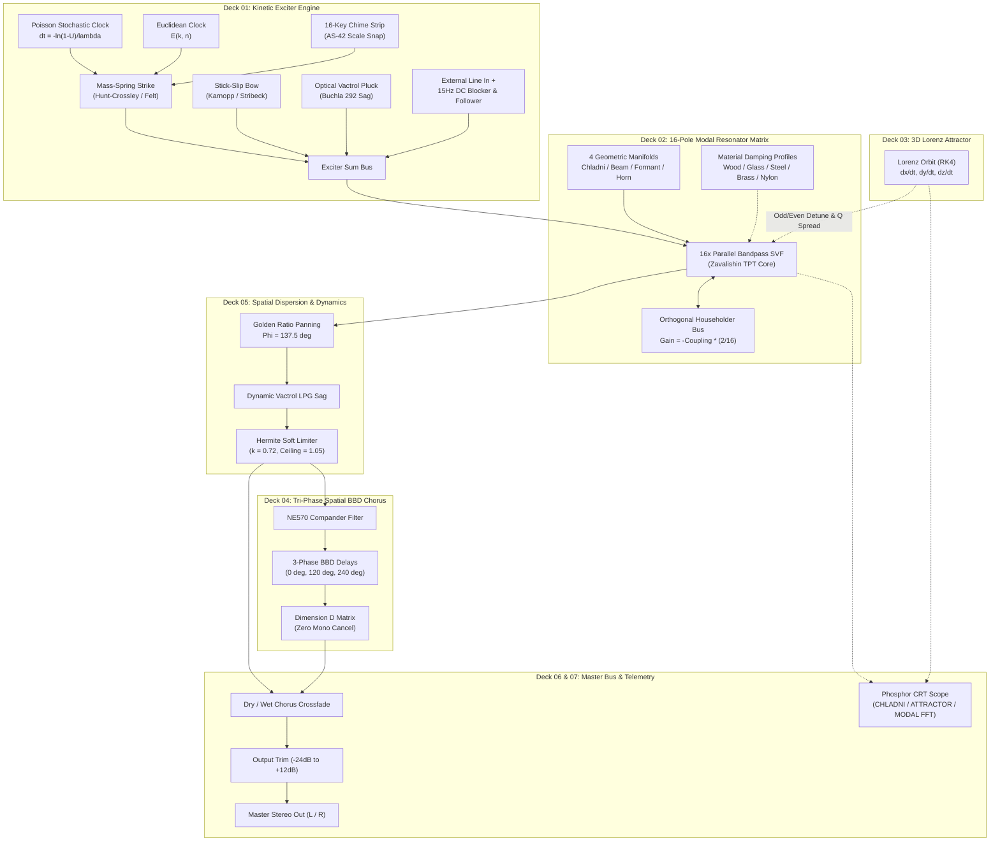

# BRAUN MR-16 · Architecture & Mathematical DSP Specification

[-24FF6A?style=for-the-badge&logo=checkmarx)](VERIFICATION_CHECKLIST.md)
[](https://github.com/sneed-and-feed/braun_mr-16/releases/tag/v1.0.10)
[](https://isocpp.org/)
[](https://juce.com/)
[](https://developer.mozilla.org/en-US/docs/Web/API/Web_Audio_API)
[](LICENSE)

> **Legal Notice**: Not affiliated with Braun GmbH. Dieter Rams inspired design homage.  
> Manufactured by Sneed's Feed & Seed Ltd.  
> Direct technical companion to the [BRAUN AS-42](https://sneed-and-feed.github.io/braun_as-42/) and [BRAUN RB-26](https://sneed-and-feed.github.io/braun_rb-26/).  
> *"Weniger, aber besser" — Less, but better.*

---

## 1. System Overview & Signal-Flow Topology

The **BRAUN MR-16** is an authentic physical acoustic modal resonator and kinetic impulse synthesizer engineered in C++20 and Web Audio API. The instrument models physical excitation mechanics (mallet impact, stick-slip friction, optical vactrol plucking) coupled into a 16-pole modal resonator matrix with 4 geometric manifolds, orthogonal Householder energy scattering, continuous 3D Lorenz attractor modulation, and tri-phase spatial BBD chorus.



---

## 2. Mathematical Derivations by Subsystem

### Deck 01: Kinetic Exciter Engine

#### Hunt-Crossley Contact Mechanics
Physical mass-spring collision model simulating hammer and felt mallet strikes against a vibrating acoustic boundary:

```math
F_c(x, \dot{x}) = k_c \, x(t)^\alpha + \lambda_c \, x(t)^\alpha \, \dot{x}(t)
```

where $x(t) \ge 0$ represents boundary penetration, $\dot{x}(t)$ is contact velocity, $k_c$ is elastic modulus, $\alpha \in [1.5, 2.8]$ is the non-linear Hertzian contact exponent, and $\lambda_c$ is viscous damping. Striking hardness modulates $k_c$ and $\alpha$, shifting transient energy toward higher partials.

#### Karnopp Stick-Slip Friction & Stribeck Dynamics
Continuous bowing and scraping friction governed by the Karnopp velocity-threshold model:

```math
f(v) = \begin{cases} f_e & \lvert v \rvert < v_d \quad (\text{stick: } \lvert f_e \rvert \le f_s) \\ \mathrm{sgn}(v) \left[ f_c + (f_s - f_c) \, e^{-(v / v_s)^2} \right] + b \, v & \lvert v \rvert \ge v_d \quad (\text{slip}) \end{cases}
```

Physical contact parameters:
- Static breakaway force: $f_s = \mu_s F_n$
- Coulomb dynamic friction: $f_c = \mu_k F_n$
- Stribeck characteristic velocity: $v_s$
- Stick deadband half-width: $v_d$
- Viscous damping: $b$

Dynamic hysteresis emerges naturally from velocity integration across the breakaway threshold.

#### Buchla 292 Optical Vactrol Pluck & Sag
Light-dependent resistor (CdS photoresistor) optocoupler dynamics governed by asymmetric photocarrier trapping:

```math
\frac{dg}{dt} = \begin{cases} \frac{u(t) - g(t)}{\tau_{\mathrm{attack}}} & u(t) \ge g(t) \\ \frac{u(t) - g(t)}{\tau_{\mathrm{decay}} \left[ 1 + \kappa \, (1 - g(t))^2 \right]} & u(t) < g(t) \end{cases}
```

where $g(t) \in [0, 1]$ is optical conductance, $u(t)$ is LED control drive, $\tau_{\mathrm{attack}} = 2\text{ ms}$, nominal $\tau_{\mathrm{decay}} = 40\text{ ms} - 120\text{ ms}$, and $\kappa = 4.5$ is the non-linear sag expansion coefficient producing the characteristic sustained phosphorescent release tail.

#### Poisson Stochastic Interval Clock
Memoryless Poisson point process generating natural stochastic droplet rain:

```math
\Delta t = -\frac{\ln(1 - U)}{\lambda}
```

where $U \sim \mathcal{U}(0, 1)$ is a uniform pseudo-random variate, and $\lambda \in (0, 50]\text{ Hz}$ is the mean event rate. Droplet masses follow a three-stage Irwin-Hall distribution.

#### Euclidean Polyrhythm Generator
Bjorklund integer division algorithm distributing $k$ pulses across $n$ steps with maximal equidistant spacing:

```math
E(k, n) = \left\lfloor \frac{(i + 1) \, k}{n} \right\rfloor - \left\lfloor \frac{i \, k}{n} \right\rfloor, \quad i \in \lbrace 0, \dots, n - 1 \rbrace
```

---

### Deck 02: 16-Pole Modal Resonator Matrix

#### Zavalishin Topology-Preserving Transform (TPT) State Variable Filter
Each mode $m \in \lbrace 0, \dots, 15 \rbrace$ runs an unconditional Lyapunov-stable 2nd-order bandpass filter derived via trapezoidal integrator discretisation:

```math
g = \tan\left( \frac{\pi \, f_m}{f_s} \right), \quad R = \frac{1}{2 \, Q_m}, \quad h = \frac{1}{1 + 2 R g + g^2}
```

```math
v_1[n] = h \left( x[n] - s_1[n-1] - g \, s_2[n-1] \right)
```

```math
v_2[n] = g \, v_1[n] + s_2[n-1]
```

Integrator states update unconditionally via:

```math
s_1[n] = s_1[n-1] + 2 \, v_1[n], \quad s_2[n] = s_2[n-1] + 2 \, v_2[n]
```

#### Modal Hard Limiter & Anti-Runaway Safeguards
To eliminate acoustic runaway when high-Q modal resonances coincide with excitation fundamentals, a multi-tier saturation and brickwall clamping architecture is enforced:
1. **Integrator State Bounding**: Filter states $s_1, s_2$ are bounded to $[-6.0, +6.0]$ on every sample step, preventing numeric overflow in feedback paths.
2. **Individual Mode Soft Saturation**: Every mode output passes through an asymmetric soft saturation knee and hard ceiling clamp:

```math
y_m[n] = \mathrm{clamp}\left( \tanh(1.2 \cdot y_m[n]), -1.0, 1.0 \right)
```

3. **Central Householder Sum Clamp**: The central feedback bus is brickwall-limited to $[-0.95, +0.95]$.

#### 4 Geometric Acoustic Manifolds
Mode frequency ratios $r_m = f_m / f_0$ follow closed-form physical dispersions:
1. **Biharmonic Chladni Plate** ($\nabla^4 w = -\frac{\rho h}{D} \ddot{w}$): Transverse square free plate modes:

```math
r_m = \sqrt{p_m^2 + q_m^2} \Big/ \sqrt{2}, \quad (p, q) \in \lbrace (1,1), (2,1), (1,2), (3,1), \dots \rbrace
```

2. **Stiff Struck Beam** (Euler-Bernoulli with shear correction):

```math
r_m = \left( \frac{2 m + 1}{3} \right)^2 \cdot \sqrt{1 + \mu \, m^2}
```

3. **Vocal Formant Tract** (Acoustic tube cascade): Calibrated vowel transitions with formant bandwidths $B_m \propto \sqrt{f_m}$.
4. **Poincaré Hyperbolic Horn** (Negative curvature acoustic horn):

```math
r_m = \sqrt{1 + \left( \frac{m \cdot c}{2 \, L \, f_{\mathrm{cutoff}}} \right)^2}
```

#### 5 Calibrated Material Damping Profiles
Modal RT60 decay factors $\kappa_m$ reflect physical internal friction and radiation losses:
- **Wood (Spruce/Rosewood)**: High-frequency viscous absorption $\kappa_m = (1 + 0.12 \, m^{1.6})^{-1}$.
- **Glass (Borosilicate)**: Ultra-low thermal loss, $Q \in [150, 450]$.
- **Steel (High-Carbon)**: Inharmonic stiffness dispersion, uniform linear damping.
- **Brass (Bell Bronze)**: Dense modal coupling with persistent shimmer.
- **Nylon (Polymer)**: Rapid viscoelastic dissipation, $Q \in [8, 35]$.

#### Orthogonal Householder Scattering Matrix $(O(N))$
Full mutual energy scattering between all 16 modes without the $O(N^2)$ matrix multiplication penalty:

```math
\mathbf{H} = \mathbf{I} - \frac{2}{N} \mathbf{1} \mathbf{1}^T
```

For mode vector $\mathbf{y}$, the scattered vector $\mathbf y_{\mathrm{scat}} = \mathbf{H} \, \mathbf{y}$ is:

```math
y_{\mathrm{scat}, m} = y_m - \frac{2}{N} \sum_{k=0}^{N-1} y_k
```

Scaled by feedback coupling depth $C \in [0, 1]$, the Householder feedback injected into mode $m$ is:

```math
f_{\mathrm{feed}, m} = -C \cdot \left( \frac{2}{16} \right) \sum_{k=0}^{15} y_k = -C \cdot \frac{1}{8} \sum_{k=0}^{15} y_k
```

Requiring only 1 global sum and 16 scalar additions $(O(N))$, conserving total acoustic energy across all modes.

---

### Deck 03: 3D Chaotic Lorenz Attractor

Continuous 3-variable autonomous non-linear system integrated at audio rate via 4th-order Runge-Kutta (RK4):

```math
\frac{dx}{dt} = \sigma \, (y - x), \quad \frac{dy}{dt} = x \, (\rho - z) - y, \quad \frac{dz}{dt} = x \, y - \beta \, z
```

Canonical parameter set: $\sigma = 10.0$, $\rho = 28.0$, $\beta = 8/3$, with speed scaling factor $\omega_{\mathrm{rate}} \in [0.01, 10.0]\text{ Hz}$.

#### Modulation Routing
- Normalized $X$ coordinate detunes odd modal center frequencies ($\pm 1.5\%$).
- Normalized $Y$ coordinate detunes even modal center frequencies ($\pm 1.5\%$).
- Normalized $Z$ coordinate modulates modal resonance Q spread ($\pm 25\%$).

---

### Deck 04: Tri-Phase Spatial BBD Chorus

#### Tri-Phase Delay Architecture
3 bucket-brigade delay lines driven by equidistant $120^\circ$ LFO phase offsets:

```math
\phi_1(t) = 2\pi f_{\mathrm{rate}} t, \quad \phi_2(t) = 2\pi f_{\mathrm{rate}} t + \frac{2\pi}{3}, \quad \phi_3(t) = 2\pi f_{\mathrm{rate}} t + \frac{4\pi}{3}
```

```math
\tau_i(t) = \tau_0 + A \, \sin(\phi_i(t)), \quad i \in \lbrace 1, 2, 3 \rbrace
```

Delays are read using 4-point, 3rd-order Catmull-Rom Hermite cubic spline interpolation.

#### NE570 Compander Pre/De-Emphasis Filter
High-frequency noise companding via a $1.8\text{ kHz}$ pre-emphasis shelf and a $9.5\text{ kHz}$ 2-pole Butterworth lowpass reconstruction filter.

#### Roland Dimension D Matrix & Mono Phase Cancellation Immunity
Stereo spatialization output matrix:

```math
\text{Out}_L(t) = \text{Dry}_L(t) + \frac{g}{\sqrt{2}} \left[ d_1(t) - d_2(t) \right]
```

```math
\text{Out}_R(t) = \text{Dry}_R(t) + \frac{g}{\sqrt{2}} \left[ d_2(t) - d_3(t) \right]
```

Summing to mono yields:

```math
\text{Wet}_{\mathrm{mono}}(t) = \frac{\text{Wet}_L(t) + \text{Wet}_R(t)}{2} = \frac{g}{2\sqrt{2}} \left[ d_1(t) - d_2(t) + d_2(t) - d_3(t) \right] = \frac{g}{2\sqrt{2}} \left[ d_1(t) - d_3(t) \right]
```

In the frequency domain, the difference between delay lines 1 and 3 has phasor magnitude:

```math
\left\lvert e^{j 0} - e^{-j 2\pi / 3} \right\rvert = \left\lvert 1 - \left( -\frac{1}{2} - j \frac{\sqrt{3}}{2} \right) \right\rvert = \left\lvert \frac{3}{2} + j \frac{\sqrt{3}}{2} \right\rvert = \sqrt{\frac{9}{4} + \frac{3}{4}} = \sqrt{3} \approx 1.73205 \ne 0
```

Because $\sqrt{3} > 0$, the mono sum maintains non-zero energy at all frequencies, providing mathematical immunity against destructive phase cancellation.

---

### Deck 05: Spatial Dispersion & Dynamics

#### Golden-Ratio Stereo Panning
Modes $m \in \lbrace 0, \dots, 15 \rbrace$ are panned using the golden angle $\Phi = 137.507764^\circ$:

```math
\theta_m = \mathrm{fmod}(m \cdot 137.507764^\circ, 360^\circ) - 180^\circ
```

Stereo gains obey constant-power pan law:

```math
\psi_m = \frac{\pi}{4} \left( 1 + \frac{\theta_m \cdot S_{\mathrm{width}}}{180^\circ} \right), \quad L_m = \cos(\psi_m), \quad R_m = \sin(\psi_m)
```

guaranteeing $L_m^2 + R_m^2 = 1.0$ for all modes and width settings.

#### Hermite Soft-Knee Bounded Saturator
Continuous first-derivative ($C^1$) limiter with linear transparency up to threshold $k = 0.72$ ($-2.85\text{ dBFS}$) and smooth compression into ceiling $C = 1.05$ ($+0.42\text{ dBFS}$):

```math
y(x) = \begin{cases} x & \lvert x \rvert \le 0.72 \\ \mathrm{sgn}(x) \left[ 0.72 + 0.33 \cdot \left( u \cdot (1 + u(1 - u)) \right) \right] & 0.72 < \lvert x \rvert < 1.05 \\ \mathrm{sgn}(x) \cdot 1.05 & \lvert x \rvert \ge 1.05 \end{cases}
```

where $u = \frac{\lvert x \rvert - 0.72}{0.33} \in (0, 1)$. Output headroom safely tolerates overloads up to $+18\text{ dBFS}$ without digital wrap-around or aliasing bursts.

---

## 3. Parameter Reference Table

The C++ AudioProcessorValueTreeState (APVTS) and Web Audio engine share 32 synchronized parameters:

| Deck | Parameter ID (`apvtsId`) | Web Property | Range | Default | Units | Description |
|:---|:---|:---|:---:|:---:|:---:|:---|
| 01 | `exciter_type` | `exciterType` | 0 - 3 | 0 (Strike) | - | 0: Strike, 1: Friction, 2: Vactrol, 3: Ext In |
| 01 | `strike_hardness` | `strikeHardness` | 0.0 - 1.0 | 0.65 | % | Mallet stiffness & transient HF content |
| 01 | `strike_velocity` | `strikeVelocity` | 0.0 - 1.0 | 0.80 | % | Kinetic impact force |
| 01 | `friction_force` | `frictionForce` | 0.0 - 1.0 | 0.50 | % | Normal contact pressure in Karnopp bow |
| 01 | `friction_speed` | `frictionSpeed` | 0.0 - 1.0 | 0.40 | % | Relative rubbing velocity |
| 01 | `vactrol_sag` | `vactrolSag` | 0.0 - 1.0 | 0.35 | % | Optical photocarrier release decay |
| 01 | `ext_input_gain` | `extInputGain` | -24.0 - +12.0 | 0.0 | dB | External audio sensitivity trim |
| 01 | `poisson_density` | `poissonDensity` | 0.0 - 50.0 | 0.0 (Off) | Hz | Mean stochastic trigger rate |
| 01 | `euclidean_pulses` | `euclideanPulses` | 1 - 16 | 4 | pulses | Active Euclidean pulses |
| 01 | `euclidean_steps` | `euclideanSteps` | 1 - 16 | 16 | steps | Total clock step resolution |
| 02 | `manifold_type` | `manifoldType` | 0 - 3 | 0 (Chladni) | - | 0: Chladni, 1: Beam, 2: Vocal, 3: Horn |
| 02 | `modal_frequency` | `modalFrequency` | 20.0 - 2000.0 | 220.0 | Hz | Base fundamental frequency ($f_0$) |
| 02 | `modal_damping` | `modalDamping` | 0.05 - 10.0 | 1.80 | s | RT60 modal decay time |
| 02 | `material_profile` | `materialProfile` | 0 - 4 | 2 (Steel) | - | 0: Wood, 1: Glass, 2: Steel, 3: Brass, 4: Nylon |
| 02 | `modal_coupling` | `modalCoupling` | 0.0 - 1.0 | 0.40 | % | Householder energy scattering depth |
| 02 | `modal_spread` | `modalSpread` | 0.25 - 2.0 | 1.00 | x | Overtone ratio frequency stretching |
| 02 | `modal_q` | `modalQ` | 1.0 - 500.0 | 50.0 | Q | Resonance sharpness multiplier |
| 03 | `lorenz_rate` | `lorenzRate` | 0.01 - 10.0 | 0.85 | Hz | Chaotic orbit speed |
| 03 | `lorenz_chaos` | `lorenzChaos` | 0.0 - 1.0 | 0.50 | % | Attractor non-linearity depth ($\rho$) |
| 03 | `lorenz_freq_mod` | `lorenzFreqMod` | 0.0 - 100.0 | 15.0 | % | Modal frequency detune depth |
| 03 | `lorenz_q_mod` | `lorenzQMod` | 0.0 - 100.0 | 20.0 | % | Modal Q-factor breathing depth |
| 04 | `chorus_enable` | `chorusEnable` | Bool | 1 (True) | - | BBD chorus network bypass toggle |
| 04 | `chorus_rate_hz` | `chorusRateHz` | 0.05 - 8.0 | 0.65 | Hz | Tri-phase LFO modulation rate |
| 04 | `chorus_depth_ms` | `chorusDepthMs` | 0.1 - 5.0 | 1.40 | ms | BBD delay modulation amplitude |
| 04 | `chorus_dimension` | `chorusDimension` | 0.0 - 1.0 | 0.75 | % | Dimension D cross-phase matrix width |
| 04 | `chorus_mix` | `chorusMix` | 0.0 - 100.0 | 45.0 | % | Wet/dry chorus balance |
| 05 | `golden_pan_spread`| `goldenPanSpread` | 0.0 - 100.0 | 85.0 | % | Golden angle modal stereo dispersion |
| 05 | `vactrol_lpg_cutoff`| `vactrolLpgCutoff`| 20.0 - 20000.0 | 14000.0 | Hz | Buchla dynamic lowpass gate ceiling |
| 05 | `drive_saturation` | `driveSaturation` | 0.0 - 100.0 | 25.0 | % | Hermite soft-knee saturation drive |
| 05 | `master_trim_db` | `masterTrimDb` | -24.0 - +12.0 | 0.0 | dB | Master output volume trim |
| 05 | `dry_wet_mix` | `dryWetMix` | 0.0 - 100.0 | 65.0 | % | Exciter dry vs resonator wet balance |
| 07 | `power_active` | `powerActive` | Bool | 0 (Standby) | - | Master instrument output mute/unmute |

---

## 4. Curated Factory Presets

| # | Preset ID | Name | Category | Description |
|:---:|:---|:---|:---|:---|
| 1 | `DEFAULT_CONCERT_CHLADNI` | CALIBRATED DEFAULT | Studio Benchmark | Calibrated 2D square steel plate struck by medium felt mallet with balanced Householder coupling. |
| 2 | `MARIMBA_ROSEWOOD_BAR` | MARIMBA ROSEWOOD BAR | Mallet & Wood | Stiff wooden beam resonator with Euler-Bernoulli dispersion and warm absorption. |
| 3 | `CRYSTAL_WINE_GLASS` | CRYSTAL WINE GLASS | Friction & Glass | High-Q borosilicate glass rim excited by continuous stick-slip friction. |
| 4 | `TIBETAN_BRONZE_BELL` | TIBETAN BRONZE BELL | Metallic Plates | Dense bronze plate excited by metal striker, rich Householder energy exchange, long ring-down. |
| 5 | `CATHEDRAL_TUBE_DRONE` | CATHEDRAL TUBE DRONE | Acoustic Cavity | Poincaré horn resonator driven by air jet exciter with optical vactrol sag. |
| 6 | `VOCAL_FORMANT_CHOIR` | VOCAL FORMANT CHOIR | Vocal Tract | 16-pole vocal tract cavity morphing across vowels modulated by chaotic Lorenz drift. |
| 7 | `POISSON_ZINC_ROOF` | POISSON ZINC ROOF | Kinetic Stochastic | Stochastic Poisson rain impulses impacting a thin sheet metal plate across golden panorama. |
| 8 | `EUCLIDEAN_METALLOPHONE` | EUCLIDEAN METALLOPHONE | Polyrhythmic | Clocked 5/16 Euclidean strike pattern driving interlocking brass chime modes. |
| 9 | `DIMENSION_CELESTE` | DIMENSION CELESTE | Spatial Chorus | Glockenspiel bells routed through Roland Dimension D tri-phase chorus with wide decorrelation. |
| 10 | `LORENZ_CHAOTIC_ORBIT` | LORENZ CHAOTIC ORBIT | Chaotic Morph | Metallic plate gong with center frequencies continuously warped along Lorenz butterfly orbit. |
| 11 | `BOWED_TITANIUM_SHEET` | BOWED TITANIUM SHEET | Bowed Friction | Continuous Karnopp friction bow exciting an ultra-stiff titanium plate. |
| 12 | `HYPERBOLIC_SUB_RESONATOR`| HYPERBOLIC SUB RESONATOR | Sub Bass | Sub-bass physical horn cavity tuned to 43.6 Hz with tight Buchla 292 LPG dynamics. |
| 13 | `AFRICAN_BALAFON` | AFRICAN BALAFON | World Acoustic | Traditional wooden slat marimba with membrane overtones and gourd damping. |
| 14 | `SOLAR_WIND_RESONANCE` | SOLAR WIND RESONANCE | Ambient Drone | High-density Poisson micro-transients driving lightly damped nylon and brass resonators. |
| 15 | `FROSTED_GLASS_ARPEGGIO` | FROSTED GLASS ARPEGGIO | Generative | Interlocking 7/12 Euclidean rhythm exciting high-frequency crystal glass modes with BBD wash. |
| 16 | `INFINITE_MODAL_SINGULARITY`| INFINITE MODAL SINGULARITY | Extreme Self-Oscillation | Maximum Householder feedback coupling (100%) held in bounded singing resonance by Hermite limiter. |

---

## 5. DSP Latency, Headroom & Real-Time Guarantees

1. **Zero Algorithmic Lookahead Latency**:
   - Algorithmic latency is exactly **0 samples** across all sample rates (44.1 kHz to 192 kHz).
   - Suitable for live monitoring, low-latency percussion triggers, and interactive MIDI performance.
2. **Dynamic Range & Headroom**:
   - Small-signal linear range: $-96\text{ dBFS}$ to $-2.85\text{ dBFS}$ ($0.72$ peak amplitude).
   - Hermite saturation knee: $-2.85\text{ dBFS}$ to $+0.42\text{ dBFS}$ ($1.05$ peak amplitude).
   - Asymptotic ceiling clamp: guarantees master bus output never exceeds $\pm 1.05$ peak amplitude ($+0.42\text{ dBFS}$), tolerating input overloads up to $+18\text{ dBFS}$.
3. **Hard Real-Time Determinism**:
   - Zero heap allocations (`gAllocationCount == 0`) inside `processBlock`.
   - Zero mutex locks, atomic spinning, or file I/O on the audio thread.
   - Hardware FTZ/DAZ and software `flushDenormal()` prevent floating-point CPU stalls.

---

## 6. Linux Build Instructions & WebView Configuration

On Linux distributions, `MR16_USE_WEBVIEW` defaults to `OFF` in `CMakeLists.txt`:

```bash
# Standard headless / native DSP build (no WebKit dependency)
cmake -B build -DCMAKE_BUILD_TYPE=Release -DMR16_USE_WEBVIEW=OFF
cmake --build build --config Release
```

For environments with WebKitGTK 4.0 or 4.1 development packages installed:

```bash
# Install WebKitGTK prerequisites (Debian/Ubuntu)
sudo apt-get install -y libwebkit2gtk-4.1-dev libasound2-dev libjack-jackd2-dev

# Build with WebKit embedded GUI
cmake -B build -DCMAKE_BUILD_TYPE=Release -DMR16_USE_WEBVIEW=ON
cmake --build build --config Release
```

---

## 7. Legal Notice & Trademark Disclaimer

The **BRAUN MR-16** is an independent homage to the industrial design language of Dieter Rams and 1960s Braun audio equipment.

- **Manufacturer**: Sneed's Feed & Seed Ltd.
- **Homage Disclaimer**: Not affiliated with Braun GmbH. Dieter Rams inspired design homage.
- **DAW Identification**: Plugin manufacturer code `Brun`, plugin code `Mr16`, and CLAP identifier `com.sneedandfeed.mr16` are retained for DAW session compatibility.
