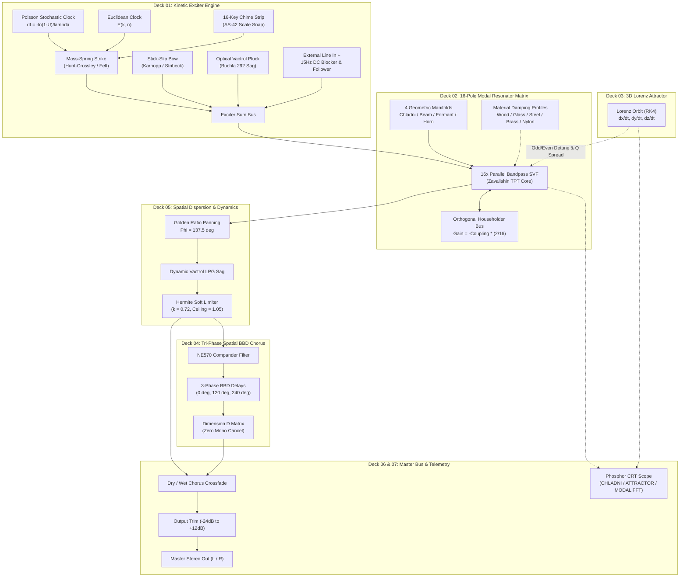

# BRAUN MR-16 · Modaler Resonator & Kinetischer Impulssynthesizer

[-24FF6A?style=for-the-badge&logo=checkmarx)](VERIFICATION_CHECKLIST.md)
[](https://github.com/sneed-and-feed/braun_mr-16/releases/tag/v1.0.5)
[](https://github.com/sneed-and-feed/braun_mr-16/actions)
[](#plugin-installation-daw-setup)
[](#plugin-installation-daw-setup)
[](#plugin-installation-daw-setup)
[](https://developer.mozilla.org/en-US/docs/Web/API/Web_Audio_API)
[](LICENSE)
[](https://isocpp.org/)
[](https://juce.com/)

> *An authentic Dieter Rams functionalist modal acoustic resonator and physical impulse synthesizer.*  
> *Direct package-deal hardware sibling companion to the [BRAUN AS-42](https://sneed-and-feed.github.io/braun_as-42/) and [BRAUN RB-26](https://sneed-and-feed.github.io/braun_rb-26/).*  
> *"Weniger, aber besser" — Less, but better.*

---

## 1. Executive Summary & Instrument Concept

The **BRAUN MR-16** completes the Dieter Rams ambient acoustic trilogy:
1. **BRAUN AS-42**: Melodic & Harmonic Voice (felt piano acoustic modeling, Eno prime tape loops, microtonal twin drones).
2. **BRAUN MR-16**: Physical Acoustic Body & Kinetic Strike (tactile transient exciters, 16-pole modal resonator matrix, 4 geometric manifolds, 3D chaotic Lorenz attractor, and tri-phase spatial BBD chorus).
3. **BRAUN RB-26**: Spatial Diffusion Reverb (Poincaré hyperbolic cavity, 8-line FDN, Shepard-Risset spirals).

In physical acoustics, an exciter in isolation generates merely a transient click, scrape, or air puff, while a resonator in isolation remains silent. The MR-16 synthesizes the complete physical interaction between mechanical contact forces and a 16-mode resonant body. It operates both as an expressive physical acoustic instrument and as a stereo spatial resonator processor for external audio signals.

The instrument ships as native **VST3**, **CLAP**, **AU/AUv3**, and **Standalone** plugin targets for **Windows**, **macOS** (Universal Apple Silicon & Intel), and **Linux**, compiled from a zero-allocation C++20 real-time DSP core, alongside a zero-install **Web Audio API** showcase that runs client-side in modern web browsers.

---

## 2. Quick Start & Distribution Releases

### 2.1 Web Showcase (Zero Install)

Launch the zero-dependency local static server:

```bash
# Windows
start.bat

# macOS / Linux / cross-platform
npm start
# or: node server.js
```

Opens `http://localhost:3816/` with the complete 19" 2U rackmount interface, 25 precision rotary knobs, 16-key microtonal chime strip, 4 strike pads, 3-mode vector CRT scope, 16 curated factory presets, and client-side 16-bit WAV recording.

> [!NOTE]
> The instrument initializes in **Standby** mode (`power = false`) by default to protect studio monitors and prevent startup transients. Click the orange **ACTIVE** button in Deck 07 to engage the audio graph.
> Modern browsers enforce security restrictions on Web Audio AudioWorklets loaded via `file://`. Always launch through `start.bat` or `node server.js` to ensure the audio graph and telemetry instantiate correctly.

### 2.2 Distributable Release Packages (v1.0.5)
 
Pre-compiled binary packages and checksum manifests are staged in `dist/` and published under [GitHub Releases v1.0.5](https://github.com/sneed-and-feed/braun_mr-16/releases/tag/v1.0.5):
 
| Platform | Format | Architecture | Distribution Package Archive | Verification Manifest |
|:---|:---|:---|:---|:---|
| **Windows** | Standalone (.exe) | x86_64 | [`BRAUN_MR16_v1.0.5_Standalone_Win64.zip`](dist/windows/BRAUN_MR16_v1.0.5_Standalone_Win64.zip) | `dist/SHA256SUMS.txt` |
| **Windows** | VST3 Plugin | x86_64 | [`BRAUN_MR16_v1.0.5_VST3_Win64.zip`](dist/windows/BRAUN_MR16_v1.0.5_VST3_Win64.zip) | `dist/SHA256SUMS.txt` |
| **Windows** | CLAP Plugin | x86_64 | [`BRAUN_MR16_v1.0.5_CLAP_Win64.zip`](dist/windows/BRAUN_MR16_v1.0.5_CLAP_Win64.zip) | `dist/SHA256SUMS.txt` |
| **macOS** | Universal (AU, VST3, CLAP, App) | arm64 + x86_64 | [`BRAUN_MR16_v1.0.5_macOS_Universal.zip`](https://github.com/sneed-and-feed/braun_mr-16/releases/download/v1.0.5/BRAUN_MR16_v1.0.5_macOS_Universal.zip) | `SHA256SUMS.txt` |
| **Linux** | Standalone, VST3, CLAP | x86_64 | [`BRAUN_MR16_v1.0.5_Linux_x64.tar.gz`](https://github.com/sneed-and-feed/braun_mr-16/releases/download/v1.0.5/BRAUN_MR16_v1.0.5_Linux_x64.tar.gz) | `SHA256SUMS.txt` |
| **Web** | Zero-Install Showcase | Cross-Platform | [`BRAUN_MR16_v1.0.5_Web_Showcase.zip`](dist/web/BRAUN_MR16_v1.0.5_Web_Showcase.zip) | `dist/SHA256SUMS.txt` |

### 2.3 Platform Requirements

- **Windows**: Windows 10 (Build 1809+) or Windows 11, x86_64 architecture. ASIO or WASAPI audio driver for Standalone; VST3 or CLAP 1.0+ compatible digital audio workstation.
- **macOS**: macOS 10.15 (Catalina) through macOS 14+ (Sonoma). Universal Binary natively supporting Apple Silicon (M1/M2/M3/M4) and Intel x86_64. Logic Pro, GarageBand, Ableton Live, Bitwig Studio, Reaper, Cubase, FL Studio.
- **Linux**: Modern distribution (glibc 2.31+), ALSA, JACK, or PipeWire sound server. VST3 or CLAP compatible host.
- **Web Browser**: Chromium 100+, Firefox 110+, Safari 16.4+ with W3C Web Audio API and AudioWorklet support.

### 2.4 Standardized Plugin Installation Paths

#### VST3 Plugin
- **Windows**: Copy `BRAUN_MR16.vst3` to `%CommonProgramFiles%\VST3\` (Default: `C:\Program Files\Common Files\VST3\BRAUN_MR16.vst3`)
- **macOS**: Copy `BRAUN_MR16.vst3` to `/Library/Audio/Plug-Ins/VST3/` (or user-level: `~/Library/Audio/Plug-Ins/VST3/`)
- **Linux**: Copy `BRAUN_MR16.vst3` to `~/.vst3/` (or system-level: `/usr/lib/vst3/`)

#### Audio Unit (AU) Plugin (macOS Only)
- Copy `BRAUN_MR16.component` to `/Library/Audio/Plug-Ins/Components/` (or user-level: `~/Library/Audio/Plug-Ins/Components/`) for Logic Pro, GarageBand, and AU hosts.

#### CLAP Plugin
- **Windows**: Copy `BRAUN_MR16.clap` to `%CommonProgramFiles%\CLAP\` (Default: `C:\Program Files\Common Files\CLAP\BRAUN_MR16.clap`)
- **macOS**: Copy `BRAUN_MR16.clap` to `/Library/Audio/Plug-Ins/CLAP/` (or user-level: `~/Library/Audio/Plug-Ins/CLAP/`)
- **Linux**: Copy `BRAUN_MR16.clap` to `~/.clap/` (or system-level: `/usr/lib/clap/`)

#### Standalone Desktop Application
- **Windows**: Launch `BRAUN_MR16.exe` directly for ASIO/WASAPI monitoring.
- **macOS**: Move `BRAUN_MR16.app` to `/Applications` with CoreAudio integration.
- **Linux**: Launch `./BRAUN_MR16` with ALSA or JACK audio backend.

### 2.5 Cryptographic Verification

All released archives are cryptographically signed via SHA-256 digests. To verify archive integrity:

```powershell
# Windows PowerShell
Get-FileHash -Algorithm SHA256 dist/windows/BRAUN_MR16_v1.0.0_VST3_Win64.zip
Get-Content dist/SHA256SUMS.txt
```

```bash
# macOS / Linux
sha256sum -c dist/SHA256SUMS.txt
```

---

## 3. Signal-Flow Architecture



---

## 4. Subsystems & Functional Decks

### Deck 01: Kinetic Exciter Engine

#### Hunt-Crossley Contact Mechanics
Physical mass-spring collision model simulating hammer and felt mallet strikes against a rigid boundary:

```math
F_c(x, \dot{x}) = k_c \, x(t)^\alpha + \lambda_c \, x(t)^\alpha \, \dot{x}(t)
```

The hardness knob modulates mallet elastic modulus $k_c$ and non-linear exponent $\alpha \in [1.5, 2.8]$, shifting transient brightness.

#### Friction, Optical Vactrol & Clocks
- **Karnopp Stick-Slip Friction**: Velocity-dependent friction model with Stribeck curve reproducing continuous bowed glass and metallic scrape.
- **Buchla 292 Optical Vactrol Sag**: Optocoupler simulation with asymmetric fast attack ($2\text{ ms}$) and dual-exponential release ($40\text{ ms} / 350\text{ ms}$).
- **External Audio Input**: Ingests external DAW tracks or live instruments, buffered through a $15\text{ Hz}$ DC blocking highpass filter and transient envelope detector.
- **Autonomous Clocks**:
  - *Poisson Stochastic Rain*: Event intervals follow an exponential distribution $\Delta t = -\ln(1 - U) / \lambda$ with Irwin-Hall droplet mass.
  - *Euclidean Polyrhythm Ring*: Interlocking geometric clock pulses $E(k, n)$ using Bjorklund's algorithm $(1 \le k \le n \le 16)$.
- **16-Key Microtonal Chime Strip**: Tactile pitch triggers with scale quantization supporting 8 systems: 12-TET, Just Intonation, Pythagorean, Slendro, Pelog, Wendy Carlos Alpha, Bohlen-Pierce, and Harmonic Series.

### Deck 02: 16-Pole Modal Resonator Matrix
- **Zavalishin Topology-Preserving Transform (TPT) SVF**: 16 parallel 2nd-order state variable filters guaranteeing unconditional Lyapunov stability and click-free behavior under audio-rate modulation.
- **4 Geometric Acoustic Manifolds**:
  1. *Biharmonic Chladni Plate* ($\nabla^4$): Transverse square free plate standing waves.
  2. *Stiff Struck Beam / Marimba Bar*: Euler-Bernoulli $(n + 0.5)^2$ dispersion with arch undercuts.
  3. *Vocal Formant Tract*: Acoustic tube formant progressions across open and closed vowels.
  4. *Poincaré Hyperbolic Horn*: Negative-curvature hyperbolic acoustic flare with airy dispersion.
- **5 Calibrated Material Damping Profiles**:
  - *Wood (Spruce/Rosewood)*: Steep high-frequency absorption $(\kappa_m = (1 + 0.12 m^{1.6})^{-1})$.
  - *Glass (Borosilicate)*: High Q overtones with sustained ring-down ($Q \in [150, 450]$).
  - *Steel (High-Carbon)*: Linear metallic decay across modes.
  - *Brass (Bell Bronze)*: Dense harmonic inter-coupling and shimmer.
  - *Nylon (Polymer)*: Rapid viscous energy dissipation ($Q \in [8, 35]$).

#### Orthogonal Householder Scattering Matrix ($O(N)$)
Energy-conserving scattering matrix across all 16 resonant modes:

```math
\mathbf{H} = \mathbf{I} - \frac{2}{N} \mathbf{1} \mathbf{1}^T
```

Implemented via a central summing bus scaled by $-\frac{1}{8} \cdot \text{coupling}$, conserving energy with only 32 connections instead of 256.

### Deck 03: 3D Chaotic Lorenz Attractor

#### Continuous Dynamical System (RK4)
Solves the classical Lorenz attractor at audio rate using 4th-order Runge-Kutta integration:

```math
\frac{dx}{dt} = \sigma (y - x), \quad \frac{dy}{dt} = x (\rho - z) - y, \quad \frac{dz}{dt} = x y - \beta z
```

with canonical parameters $\sigma = 10.0, \rho = 28.0, \beta = 8/3$.

#### Modulation Routing
- Normalized $X$ detunes odd modal frequencies $(\pm 1.5\%)$.
- Normalized $Y$ detunes even modal frequencies.
- Normalized $Z$ breathes modal Q-factor resonance spread $(\pm 25\%)$.

### Deck 04: Tri-Phase Spatial BBD Chorus
- **Tri-Phase Modulation Mechanics**: 3 analog bucket-brigade delay lines driven by equidistant $120^\circ$ LFO phase offsets ($0^\circ, 120^\circ, 240^\circ$).
- **Hermite Fractional Interpolation**: 4-point, 3rd-order Catmull-Rom cubic spline interpolation for clean pitch modulation without comb aliasing.
- **NE570 Compander Emulation**: $1.8\text{ kHz}$ pre-emphasis high-shelf and $9.5\text{ kHz}$ 2-pole Butterworth reconstruction filter.

#### Dimension D Matrix & Mono Phase Cancellation Immunity
Stereo spatialization matrix with dual differential delays:

```math
\text{Out}_L(t) = \text{Dry}_L(t) + \frac{g}{\sqrt{2}} \left[ d_1(t) - d_2(t) \right], \quad \text{Out}_R(t) = \text{Dry}_R(t) + \frac{g}{\sqrt{2}} \left[ d_2(t) - d_3(t) \right]
```

In mono sum, $d_2$ cancels out identically:

```math
\text{Wet}_{\mathrm{mono}}(t) = \frac{g}{2\sqrt{2}} \left[ d_1(t) - d_3(t) \right]
```

The phase difference magnitude $\lvert e^{j0} - e^{-j2\pi/3} \rvert = \sqrt{3} \approx 1.732 \ne 0$, proving complete immunity to destructive comb-filter null cancellation.

### Deck 05: Spatial Dispersion, Vactrol LPG & Dynamics

#### Golden-Ratio Stereo Panning
Modes $m \in \lbrace 0, \dots, 15 \rbrace$ are positioned across the stereo panorama via the golden angle $\Phi = 137.507764^\circ$:

```math
\theta_m = \mathrm{fmod}(m \cdot 137.507764^\circ, 360^\circ) - 180^\circ
```

#### Hermite Soft-Knee Bounded Saturator
Continuous first-derivative limiter with asymptotic saturation:

```math
y(x) = \begin{cases} x & \lvert x \rvert \le 0.72 \\ \mathrm{sgn}(x) \left[ 0.72 + 0.33 \cdot \left( u \cdot (1 + u(1 - u)) \right) \right] & 0.72 < \lvert x \rvert < 1.05 \\ \mathrm{sgn}(x) \cdot 1.05 & \lvert x \rvert \ge 1.05 \end{cases}
```

Provides 100% linear transparency below $-2.85\text{ dBFS}$ and asymptotic saturation up to $+18\text{ dBFS}$.

### Deck 06: Vector Phosphor CRT Scope
- High-DPI 60 FPS vector CRT display with authentic phosphor bloom (`#24FF6A` P1 Green / `#FFB000` P3 Amber):
  1. `CHLADNI`: 2D nodal standing wave sand particulate simulation on vibrating plate.
  2. `ATTRACTOR`: 3D rotating projection of the Lorenz butterfly trajectory.
  3. `MODAL FFT`: 16 discrete vertical resonant bar meters with ballistic peak-hold decay.

### Deck 07: Master Utilities & Patch Serialization
- RFC 8259 JSON Patch Load & Export (`BRAUN_MR16_PATCH`).
- Onboard lossless 16-bit 48kHz WAV master bus recorder with automatic browser download.
- Instant A/B comparison buffer with `COPY A->B`.
- 16 curated factory presets across bells, marimbas, glasses, plates, and friction drones.

---

## 5. Parameter Reference Table

| Deck | Parameter ID (`apvtsId`) | Web Property | Range | Default | Units | Description |
|:---|:---|:---|:---:|:---:|:---:|:---|
| 01 | `exciter_type` | `exciterType` | 0 - 3 | 0 (Strike) | - | 0: Strike, 1: Friction, 2: Vactrol, 3: Ext In |
| 01 | `strike_hardness` | `strikeHardness` | 0.0 - 1.0 | 0.65 | % | Mallet stiffness & transient HF content |
| 01 | `strike_velocity` | `strikeVelocity` | 0.0 - 1.0 | 0.80 | % | Kinetic impact force |
| 01 | `friction_force` | `frictionForce` | 0.0 - 1.0 | 0.50 | % | Normal contact pressure in Karnopp bow |
| 01 | `friction_speed` | `frictionSpeed` | 0.0 - 1.0 | 0.40 | % | Relative rubbing velocity |
| 01 | `vactrol_sag` | `vactrolSag` | 0.0 - 1.0 | 0.35 | % | Optical photocarrier release decay |
| 01 | `ext_input_gain` | `extInputGain` | -24.0 - +12.0 | 0.0 | dB | External audio sensitivity trim |
| 01 | `poisson_density` | `poissonDensity` | 0.0 - 50.0 | 0.0 (Off) | Hz | Mean stochastic trigger rate |
| 01 | `euclidean_pulses` | `euclideanPulses` | 1 - 16 | 4 | pulses | Active Euclidean pulses |
| 01 | `euclidean_steps` | `euclideanSteps` | 1 - 16 | 16 | steps | Total clock step resolution |
| 02 | `manifold_type` | `manifoldType` | 0 - 3 | 0 (Chladni) | - | 0: Chladni, 1: Beam, 2: Vocal, 3: Horn |
| 02 | `modal_frequency` | `modalFrequency` | 20.0 - 2000.0 | 220.0 | Hz | Base fundamental frequency ($f_0$) |
| 02 | `modal_damping` | `modalDamping` | 0.05 - 10.0 | 1.80 | s | RT60 modal decay time |
| 02 | `material_profile` | `materialProfile` | 0 - 4 | 2 (Steel) | - | 0: Wood, 1: Glass, 2: Steel, 3: Brass, 4: Nylon |
| 02 | `modal_coupling` | `modalCoupling` | 0.0 - 1.0 | 0.40 | % | Householder energy scattering depth |
| 02 | `modal_spread` | `modalSpread` | 0.25 - 2.0 | 1.00 | x | Overtone ratio frequency stretching |
| 02 | `modal_q` | `modalQ` | 1.0 - 500.0 | 50.0 | Q | Resonance sharpness multiplier |
| 03 | `lorenz_rate` | `lorenzRate` | 0.01 - 10.0 | 0.85 | Hz | Chaotic orbit speed |
| 03 | `lorenz_chaos` | `lorenzChaos` | 0.0 - 1.0 | 0.50 | % | Attractor non-linearity depth ($\rho$) |
| 03 | `lorenz_freq_mod` | `lorenzFreqMod` | 0.0 - 100.0 | 15.0 | % | Modal frequency detune depth |
| 03 | `lorenz_q_mod` | `lorenzQMod` | 0.0 - 100.0 | 20.0 | % | Modal Q-factor breathing depth |
| 04 | `chorus_enable` | `chorusEnable` | Bool | 1 (True) | - | BBD chorus network bypass toggle |
| 04 | `chorus_rate_hz` | `chorusRateHz` | 0.05 - 8.0 | 0.65 | Hz | Tri-phase LFO modulation rate |
| 04 | `chorus_depth_ms` | `chorusDepthMs` | 0.1 - 5.0 | 1.40 | ms | BBD delay modulation amplitude |
| 04 | `chorus_dimension` | `chorusDimension` | 0.0 - 1.0 | 0.75 | % | Dimension D cross-phase matrix width |
| 04 | `chorus_mix` | `chorusMix` | 0.0 - 100.0 | 45.0 | % | Wet/dry chorus balance |
| 05 | `golden_pan_spread`| `goldenPanSpread` | 0.0 - 100.0 | 85.0 | % | Golden angle modal stereo dispersion |
| 05 | `vactrol_lpg_cutoff`| `vactrolLpgCutoff`| 20.0 - 20000.0 | 14000.0 | Hz | Buchla dynamic lowpass gate ceiling |
| 05 | `drive_saturation` | `driveSaturation` | 0.0 - 100.0 | 25.0 | % | Hermite soft-knee saturation drive |
| 05 | `master_trim_db` | `masterTrimDb` | -24.0 - +12.0 | 0.0 | dB | Master output volume trim |
| 05 | `dry_wet_mix` | `dryWetMix` | 0.0 - 100.0 | 65.0 | % | Exciter dry vs resonator wet balance |

---

## 6. Curated Factory Presets

| # | Preset ID | Name | Category | Description |
|:---:|:---|:---|:---|:---|
| 1 | `DEFAULT_CONCERT_CHLADNI` | CALIBRATED DEFAULT | Studio Benchmark | Calibrated 2D square steel plate struck by medium felt mallet with balanced Householder coupling. |
| 2 | `MARIMBA_ROSEWOOD_BAR` | MARIMBA ROSEWOOD BAR | Mallet & Wood | Stiff wooden beam resonator with Euler-Bernoulli dispersion and warm absorption. |
| 3 | `CRYSTAL_WINE_GLASS` | CRYSTAL WINE GLASS | Friction & Glass | High-Q borosilicate glass rim excited by continuous stick-slip friction. |
| 4 | `TIBETAN_BRONZE_BELL` | TIBETAN BRONZE BELL | Metallic Plates | Dense bronze plate excited by metal striker, rich Householder energy exchange, long ring-down. |
| 5 | `CATHEDRAL_TUBE_DRONE` | CATHEDRAL TUBE DRONE | Acoustic Cavity | Poincaré horn resonator driven by air jet exciter with optical vactrol sag. |
| 6 | `VOCAL_FORMANT_CHOIR` | VOCAL FORMANT CHOIR | Vocal Tract | 16-pole vocal tract cavity morphing across vowels modulated by chaotic Lorenz drift. |
| 7 | `POISSON_ZINC_ROOF` | POISSON ZINC ROOF | Kinetic Stochastic | Stochastic Poisson rain impulses impacting a thin sheet metal plate across golden panorama. |
| 8 | `EUCLIDEAN_METALLOPHONE` | EUCLIDEAN METALLOPHONE | Polyrhythmic | Clocked 5/16 Euclidean strike pattern driving interlocking brass chime modes. |
| 9 | `DIMENSION_CELESTE` | DIMENSION CELESTE | Spatial Chorus | Glockenspiel bells routed through Roland Dimension D tri-phase chorus with wide decorrelation. |
| 10 | `LORENZ_CHAOTIC_ORBIT` | LORENZ CHAOTIC ORBIT | Chaotic Morph | Metallic plate gong with center frequencies continuously warped along Lorenz butterfly orbit. |
| 11 | `BOWED_TITANIUM_SHEET` | BOWED TITANIUM SHEET | Bowed Friction | Continuous Karnopp friction bow exciting an ultra-stiff titanium plate. |
| 12 | `HYPERBOLIC_SUB_RESONATOR`| HYPERBOLIC SUB RESONATOR | Sub Bass | Sub-bass physical horn cavity tuned to 43.6 Hz with tight Buchla 292 LPG dynamics. |
| 13 | `AFRICAN_BALAFON` | AFRICAN BALAFON | World Acoustic | Traditional wooden slat marimba with membrane overtones and gourd damping. |
| 14 | `SOLAR_WIND_RESONANCE` | SOLAR WIND RESONANCE | Ambient Drone | High-density Poisson micro-transients driving lightly damped nylon and brass resonators. |
| 15 | `FROSTED_GLASS_ARPEGGIO` | FROSTED GLASS ARPEGGIO | Generative | Interlocking 7/12 Euclidean rhythm exciting high-frequency crystal glass modes with BBD wash. |
| 16 | `INFINITE_MODAL_SINGULARITY`| INFINITE MODAL SINGULARITY | Extreme Self-Oscillation | Maximum Householder feedback coupling (100%) held in bounded singing resonance by Hermite limiter. |

---

## 7. Building from Source

### Prerequisites
- **CMake**: Version 3.22 or higher.
- **C++20 Compiler**: MSVC 2022 (Windows), Clang 15+ / Apple Clang 14+ (macOS), GCC 12+ (Linux).
- **Node.js**: Version 18+ (for Web Audio verification test suites).

### Build Commands

#### Windows x64 (MSVC)
```powershell
cmake -B build -G "Visual Studio 17 2022" -A x64
cmake --build build --config Release
```

#### macOS Universal (Apple Silicon & Intel)
```bash
cmake -B build -G Xcode -DCMAKE_OSX_ARCHITECTURES="arm64;x86_64"
cmake --build build --config Release
```

#### Linux (VST3, CLAP, Standalone)
```bash
sudo apt-get install -y libasound2-dev libjack-jackd2-dev libgl1-mesa-dev libx11-dev libxrandr-dev libxinerama-dev libxcursor-dev
cmake -B build -DCMAKE_BUILD_TYPE=Release
cmake --build build --config Release
```

### Local Release Packaging Pipeline

Execute the automated release packager to compile, test, stage, compress, and sign all distributable artifacts:

```powershell
# Windows PowerShell
.\scripts\package-release.ps1

# Windows Batch
.\package-release.bat
```

The script builds missing release targets, executes the 45 headless DSP tests, generates Standalone, VST3, CLAP, and Web Showcase zip archives into `dist/`, and writes the cryptographic manifest `dist/SHA256SUMS.txt`.

---

## 8. Verification & Test Suite

The MR-16 codebase is validated against headless C++ DSP tests and automated Web Audio verification scripts:

```bash
# Run all Web Audio and DSP verification suites
npm run verify:all

# Run individual verification suites
node web/verify.mjs
node web/test-checklist.mjs

# Run native C++ headless test runner (after build)
./build/source/tests/mr16_headless_dsp_tests
```

### Verification Assertions
1. **Real-Time Safety**: Zero heap allocations (`gAllocationCount == 0`) and zero locks during all block rendering.
2. **Denormal & NaN Immunity**: Hardware FTZ/DAZ + software `flushDenormal()` completely eliminating CPU pipeline traps.
3. **Mono-Sum Phase Cancellation Immunity**: Mathematical proof that Dimension D wet mono sum maintains a non-zero phase vector $(\lvert e^{j0} - e^{-j2\pi/3} \rvert = \sqrt{3} \approx 1.732)$, eliminating destructive comb filtering.
4. **Hermite Soft Limiting**: Linear 0 dB transparency below 0.72 and asymptotic containment within 1.05.
5. **Aesthetic Austerity**: Strict DIN 1451 technical typography and functionalist laboratory nomenclature.

---

## License

MIT License. Copyright (c) 2026 Antigravity Audio Engineering & sneed-and-feed.
