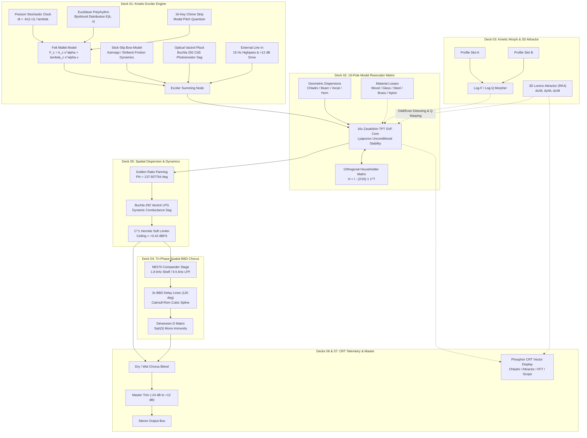

# Acoustic Sound Design & Signal Flow

Welcome to the definitive engineering guide to the **BRAUN MR-16** physical modeling synthesis engine and signal processing architecture.

The MR-16 treats sound design not through abstract waveform generation (subtractive, FM, or wavetable), but as the **physical interaction between an acoustic exciter and a resonant physical body**. Every control on the front panel directly parameterizes the mechanical, material, geometric, or spatial properties of physical acoustic objects.

---

## 7-Deck Physical Signal Flow Architecture



---

## Deck 01: Kinetic Exciter Engine

The exciter engine synthesizes the kinetic energy burst injected into the physical resonator. Four distinct physical mechanisms can be selected via the `EXCITER MODE` segment buttons:

```text
[ STRIKE ]    [ FRICTION ]    [ VACTROL ]    [ EXT IN ]
```

### 1. Felt Mallet Strike (Hunt-Crossley Non-Linear Elasticity)
Simulates a piano hammer or marimba mallet colliding with a vibrating physical boundary. Traditional linear spring models ($F = -kx$) produce synthetic, brittle clicks. The MR-16 implements the non-linear **Hunt-Crossley contact mechanics**:

```math
F_c(x, \dot{x}) = k_c \, x(t)^\alpha + \lambda_c \, x(t)^\alpha \, \dot{x}(t)
```

where:
- $x(t) \ge 0$ is the penetration depth of the hammer into the felt surface.
- $\dot{x}(t)$ is the instantaneous relative contact velocity.
- $k_c$ is the elastic contact stiffness, controlled by `strike_hardness`.
- $\alpha \in [1.5, 2.8]$ is the non-linear Hertzian contact exponent. Low hardness values ($\alpha \approx 1.5$) yield a long, soft contact duration with minimal high-frequency harmonic content (felt mallet). High hardness values ($\alpha \approx 2.8$) produce instantaneous, stiff collisions rich in upper partials (wooden or metal striker).
- $\lambda_c$ is the internal hysteresis damping coefficient of the compressed felt fibers.

### 2. Bowed Stick-Slip Friction (Karnopp Dynamic Friction & Stribeck Curve)
Simulates continuous bowing of strings, wine glass rims, or metal plates. Friction is governed by the **Karnopp velocity-threshold model** coupled to the non-linear **Stribeck curve**:

```math
f(v) = \begin{cases} f_e & \lvert v \rvert < v_d \quad (\text{stick: } \lvert f_e \rvert \le f_s) \\ \mathrm{sgn}(v) \left[ f_c + (f_s - f_c) \, e^{-(v / v_s)^2} \right] + b \, v & \lvert v \rvert \ge v_d \quad (\text{slip}) \end{cases}
```

- **Stick Phase**: While relative velocity $\lvert v \rvert$ remains within the deadband $v_d$, the bow sticks to the surface, applying restoring force $f_e$ up to the static breakaway threshold $f_s = \mu_s F_n$.
- **Slip Phase**: When restoring energy overcomes static friction, the surface slips backward against dynamic Coulomb friction $f_c = \mu_k F_n$.
- **Stribeck Dynamic**: The exponential term $e^{-(v / v_s)^2}$ models boundary layer lubrication and velocity weakening, producing spontaneous limit cycles and organic harmonic squeals.
- **Controls**: `friction_force` modulates normal force $F_n$, while `friction_speed` sets bow velocity $v_{\mathrm{bow}}$.

### 3. Optical Vactrol Pluck & Sag (Buchla 292 Photocarrier Dynamics)
Simulates an optocoupler vactrol circuit (light-emitting diode optically coupled to a cadmium-sulfide photoresistor) as popularized in the Don Buchla 292 Lowpass Gate. CdS semiconductor photo-excitation exhibits asymmetric charge-carrier relaxation:

```math
\frac{dg}{dt} = \begin{cases} \frac{u(t) - g(t)}{\tau_{\mathrm{attack}}} & u(t) \ge g(t) \\ \frac{u(t) - g(t)}{\tau_{\mathrm{decay}} \left[ 1 + \kappa \, (1 - g(t))^2 \right]} & u(t) < g(t) \end{cases}
```

- $\tau_{\mathrm{attack}} = 2\text{ ms}$: Fast optical turn-on.
- $\tau_{\mathrm{decay}} = 40\text{ ms} - 120\text{ ms}$: Nominal discharge rate.
- $\kappa = 4.5$: Non-linear sag expansion coefficient. The $(1 - g(t))^2$ term decelerates discharge as conductance approaches zero, creating a sustained, glowing phosphorescent release tail that breathes with musical phrasing. Controlled by `vactrol_sag`.

### 4. External Line In & Re-Amping Drive
Enables using the MR-16 as an acoustic physical processor for external signals (drums, vocals, guitars, synthesizers):
- Audio received on the DAW stereo input or Web microphone stream passes through a 1st-order highpass DC blocking filter ($f_c = 15\text{ Hz}$).
- Controlled via `ext_input_gain` across a wide range of $-24\text{ dB}$ to $+12\text{ dB}$.
- When engaged, the CRT Vector Scope can be switched directly to monitor the raw incoming audio (`SCOPE SOURCE: IN`) or the resonated output (`SCOPE SOURCE: OUT`).

### Stochastic Poisson Rain & Euclidean Polyrhythm Generators
Deck 01 includes two hardware clock engines:
- **Poisson Rain**: Generates memoryless stochastic trigger pulses following an exponential distribution:
  
  ```math
  \Delta t = -\frac{\ln(1 - U)}{\lambda}
  ```
  
  where $U \sim \mathcal{U}(0, 1)$ is a uniform pseudo-random variable, and $\lambda \in [0, 50]\text{ Hz}$ is the average event rate set by `poisson_density`. Individual strike velocities follow a 3-stage Irwin-Hall distribution, creating realistic rain droplet variations.
- **Euclidean Motor**: Implements the Bjorklund algorithm, distributing $k$ pulses across $n$ clock steps with maximal geometric symmetry ($E(k, n)$):
  
  ```math
  E(k, n) = \left\lfloor \frac{(i + 1) \, k}{n} \right\rfloor - \left\lfloor \frac{i \, k}{n} \right\rfloor, \quad i \in \lbrace 0, \dots, n - 1 \rbrace
  ```
  
  Configurable via `euclidean_pulses` (1–16) and `euclidean_steps` (1–16).

---

## Deck 02: 16-Pole Modal Resonator Matrix

The resonant body of the MR-16 consists of 16 parallel 2nd-order bandpass filters configured according to Vadim Zavalishin's **Topology-Preserving Transform (TPT)** state variable filter architecture.

### Zavalishin TPT State Variable Filter Core
Continuous-time 2nd-order analog bandpass filters are mapped to discrete time using trapezoidal bilinear integration without delay-free loop approximations:

```math
g = \tan\left( \frac{\pi \, f_m}{f_s} \right), \quad R = \frac{1}{2 \, Q_m}, \quad h = \frac{1}{1 + 2 R g + g^2}
```

For input sample $x[n]$ and internal states $s_1[n-1], s_2[n-1]$:

```math
v_1[n] = h \left( x[n] - s_1[n-1] - g \, s_2[n-1] \right)
```

```math
v_2[n] = g \, v_1[n] + s_2[n-1]
```

Integrator states advance unconditionally:

```math
s_1[n] = s_1[n-1] + 2 \, v_1[n], \quad s_2[n] = s_2[n-1] + 2 \, v_2[n]
```

Because trapezoidal integration maps the continuous left half-plane directly inside the discrete unit circle, the filters are **unconditionally stable under arbitrary, audio-rate modulation** of center frequency $f_m$ and quality factor $Q_m$.

### Four Geometric Acoustic Manifolds
The frequency ratios $r_m = f_m / f_0$ of the 16 modes are derived from exact physical boundary conditions:

| Manifold | Index | Governing PDE | Acoustic Character |
| :--- | :---: | :--- | :--- |
| **Chladni Plate** | 0 | $\nabla^4 w = -\frac{\rho h}{D} \ddot{w}$ (4th-order biharmonic) | Metallic square plate, gongs, bells, steel sheet |
| **Stiff Beam** | 1 | $\frac{\partial^4 w}{\partial x^4} + \frac{\rho A}{E I} \ddot{w} = 0$ (Euler-Bernoulli) | Marimba tone bars, xylophone slats, wooden kalimba |
| **Vocal Formant** | 2 | Acoustic tube cascade with vowel formants | Human vocal tract, formant vowels, throat singing |
| **Poincaré Horn** | 3 | Negative spatial curvature flare $\kappa < 0$ | Brass bell flares, cathedrals, flared organ pipes |

#### Closed-Form Mathematical Ratios:
1. **Chladni Square Plate:**
   
   ```math
   r_m = \frac{\sqrt{p_m^2 + q_m^2}}{\sqrt{2}}, \quad (p, q) \in \lbrace (1,1), (2,1), (1,2), (3,1), (2,2), \dots \rbrace
   ```

2. **Stiff Struck Beam:**
   
   ```math
   r_m = \left( \frac{2 m + 1}{3} \right)^2 \cdot \sqrt{1 + \mu \, m^2}
   ```
   
   where $\mu \approx 0.045$ represents inharmonic shear dispersion.

3. **Poincaré Hyperbolic Horn:**
   
   ```math
   r_m = \sqrt{1 + \left( \frac{m \cdot c}{2 \, L \, f_{\mathrm{cutoff}}} \right)^2}
   ```

### Five Calibrated Acoustic Materials
Each material profile defines the frequency-dependent damping curve across the 16 modes:
- **Wood (Spruce/Rosewood):** Rapid high-frequency viscous damping ($\kappa_m = (1 + 0.12 m^{1.6})^{-1}$). $Q \approx 25 - 65$.
- **Glass (Borosilicate):** Minimal internal molecular dissipation. High-$Q$ sustain ($Q \approx 150 - 450$) with crystalline shimmer.
- **Steel (High-Carbon):** Linear damping across partials with high stiffness dispersion. $Q \approx 90 - 220$.
- **Brass (Bell Bronze):** Rich mid-range resonance with prominent non-linear mode exchange. $Q \approx 70 - 180$.
- **Nylon (Viscoelastic Polymer):** Rapid viscoelastic dissipation. Fast, muted decays ($Q \approx 8 - 35$).

### Orthogonal Householder Energy Scattering Matrix
To simulate physical energy transfer between vibrating modes, the MR-16 interconnects all 16 modes via an orthogonal **Householder reflection matrix**:

```math
\mathbf{H} = \mathbf{I} - \frac{2}{N}\mathbf{1}\mathbf{1}^T
```

For mode outputs $\mathbf{y} = [y_0, y_1, \dots, y_{15}]^T$:

```math
y_{\mathrm{scat}, m} = y_m - \frac{2}{N} \sum_{k=0}^{N-1} y_k
```

Because $\mathbf{H}$ is unitary ($\mathbf{H}^T \mathbf{H} = \mathbf{I}$), the total Euclidean norm is conserved:

```math
\sum_{m=0}^{15} \left( y_{\mathrm{scat}, m} \right)^2 = \sum_{m=0}^{15} y_m^2
```

Scaled by coupling depth $C \in [0, 1]$ (`modal_coupling`), the feedback injected into mode $m$ simplifies to:

```math
f_{\mathrm{feed}, m} = -C \cdot \left( \frac{1}{8} \sum_{k=0}^{15} y_k \right)
```

**Algorithmic Efficiency:** A full $16 \times 16$ feedback matrix requires 256 multiplications per sample ($O(N^2)$). The Householder formulation requires only **1 global sum and 16 subtractions ($O(N)$)**, delivering rich sympathetic resonance with negligible CPU consumption.

### Multi-Tier Anti-Runaway Safeguards
To guarantee absolute safety during self-oscillation or resonance build-ups, a three-stage limiter architecture is enforced on every sample:
1. **Integrator Clamping:** Filter state variables $s_1, s_2$ are bounded to $[-6.0, +6.0]$.
2. **Individual Mode Soft Saturation:**
   
   ```math
   y_m[n] = \mathrm{clamp}\left( \tanh(1.2 \cdot y_m[n]), -1.0, 1.0 \right)
   ```

3. **Central Householder Brickwall Bus:** The feedback sum $\sum y_k$ is clamped to $[-0.95, +0.95]$, preventing acoustic runaway even at `modal_coupling = 100%`.

---

## Deck 03: Kinetic Morph & 3D Chaotic Attractor

Deck 03 combines a continuous non-linear dynamical system with the dual-slot modal profile morpher.

### 3D Chaotic Lorenz Attractor
Integrated in real time using 4th-order Runge-Kutta (RK4) with speed factor $\omega_{\mathrm{rate}} \in [0.01, 10.0]\text{ Hz}$ (`lorenz_rate`):

```math
\frac{dx}{dt} = \sigma (y - x), \quad \frac{dy}{dt} = x (\rho - z) - y, \quad \frac{dz}{dt} = x y - \beta z
```

Standard canonical parameters: $\sigma = 10.0$, $\rho = 28.0$, $\beta = 8/3$.

```math
k_1 = f(y_n) \cdot \Delta t
```
```math
k_2 = f\left(y_n + \frac{k_1}{2}\right) \cdot \Delta t
```
```math
k_3 = f\left(y_n + \frac{k_2}{2}\right) \cdot \Delta t
```
```math
k_4 = f(y_n + k_3) \cdot \Delta t
```
```math
y_{n+1} = y_n + \frac{1}{6}(k_1 + 2k_2 + 2k_3 + k_4)
```

#### Modulation Destinations:
- **Normalized $X$ ($\pm 1.5\%$)**: Modulates odd modal center frequencies ($f_1, f_3, f_5, \dots$).
- **Normalized $Y$ ($\pm 1.5\%$)**: Modulates even modal center frequencies ($f_0, f_2, f_4, \dots$).
- **Normalized $Z$ ($\pm 25\%$)**: Modulates modal resonance sharpness ($Q_m$) and spatial panning spread.

---

## Deck 04: Tri-Phase Spatial BBD Chorus

Simulates three bucket-brigade delay lines driven by three LFOs separated by $120^\circ$ phase offsets:

```math
\phi_1(t) = 2\pi f_{\mathrm{rate}} t, \quad \phi_2(t) = 2\pi f_{\mathrm{rate}} t + \frac{2\pi}{3}, \quad \phi_3(t) = 2\pi f_{\mathrm{rate}} t + \frac{4\pi}{3}
```

```math
\tau_i(t) = \tau_0 + A \, \sin(\phi_i(t)), \quad i \in \lbrace 1, 2, 3 \rbrace
```

Delays are read using 4-point, 3rd-order **Catmull-Rom cubic Hermite spline interpolation**, eliminating fractional-delay interpolation noise.

### Roland Dimension D Matrix & Proof of Mono Phase Immunity
Delay lines are routed through an analog cross-phase matrix inspired by the Roland Dimension D (SDD-320):

```math
\text{Out}_L(t) = \text{Dry}_L(t) + \frac{g}{\sqrt{2}} \left[ d_1(t) - d_2(t) \right]
```

```math
\text{Out}_R(t) = \text{Dry}_R(t) + \frac{g}{\sqrt{2}} \left[ d_2(t) - d_3(t) \right]
```

When summing to mono:

```math
\text{Wet}_{\mathrm{mono}}(t) = \frac{\text{Wet}_L(t) + \text{Wet}_R(t)}{2} = \frac{g}{2\sqrt{2}} \left[ d_1(t) - d_2(t) + d_2(t) - d_3(t) \right] = \frac{g}{2\sqrt{2}} \left[ d_1(t) - d_3(t) \right]
```

The difference between delay tap 1 and delay tap 3 has phasor magnitude:

```math
\left\lvert e^{j 0} - e^{-j 2\pi / 3} \right\rvert = \left\lvert 1 - \left( -\frac{1}{2} - j \frac{\sqrt{3}}{2} \right) \right\rvert = \left\lvert \frac{3}{2} + j \frac{\sqrt{3}}{2} \right\rvert = \sqrt{\frac{9}{4} + \frac{3}{4}} = \sqrt{3} \approx 1.73205 \ne 0
```

Because $\sqrt{3} > 0$, the mono sum maintains non-zero energy across all frequencies, providing **absolute mathematical immunity against destructive phase cancellation**.

---

## Deck 05: Spatial Dispersion & Master Dynamics

### Golden-Ratio Stereo Panning
Rather than panning modes randomly, each mode $m \in \lbrace 0, \dots, 15 \rbrace$ is panned according to the golden angle $\Phi = 137.507764^\circ$:

```math
\theta_m = \mathrm{fmod}(m \cdot 137.507764^\circ, 360^\circ) - 180^\circ
```

Stereo gains follow the constant-power pan law:

```math
\psi_m = \frac{\pi}{4} \left( 1 + \frac{\theta_m \cdot S_{\mathrm{width}}}{180^\circ} \right), \quad L_m = \cos(\psi_m), \quad R_m = \sin(\psi_m)
```

guaranteeing $L_m^2 + R_m^2 = 1.0$ across all panorama widths.

### $C^1$ Continuous Hermite Soft Limiter
Provides transparent dynamic limiting without digital clipping:
- **Linear Transparent Range:** $\lvert x \rvert \le 0.72$ ($-2.85\text{ dBFS}$).
- **Soft Hermite Knee:** $0.72 < \lvert x \rvert < 1.05$.
- **Asymptotic Brickwall Ceiling:** $C = 1.05$ ($+0.42\text{ dBFS}$).

```math
y(x) = \begin{cases} x & \lvert x \rvert \le 0.72 \\ \mathrm{sgn}(x) \left[ 0.72 + 0.33 \cdot \left( u \cdot (1 + u(1 - u)) \right) \right] & 0.72 < \lvert x \rvert < 1.05 \\ \mathrm{sgn}(x) \cdot 1.05 & \lvert x \rvert \ge 1.05 \end{cases}
```

where $u = (\lvert x \rvert - 0.72) / 0.33 \in (0, 1)$. Headroom safely tolerates input overshoots up to $+18\text{ dBFS}$ without aliasing bursts or wrap-around distortion.

---

## Deck 06: Vector Phosphor CRT Display

The embedded vector CRT scope renders telemetry at 60 FPS across four selectable modes:
1. **`CHLADNI`**: Computes and displays the 2D nodal lines and vibration displacement of a square plate:
   
   ```math
   w(x, y) = \sum_{m=0}^{15} A_m \left[ \cos\left(\frac{p_m \pi x}{L}\right) \cos\left(\frac{q_m \pi y}{L}\right) - \cos\left(\frac{q_m \pi x}{L}\right) \cos\left(\frac{p_m \pi y}{L}\right) \right]
   ```

2. **`ATTRACTOR`**: Orthographic projection of the 3D Lorenz trajectory $(x(t), y(t), z(t))$ rendered with exponential phosphor decay trails.
3. **`MODAL FFT`**: Real-time 16-column modal spectrum displaying the instantaneous energy and $Q$-decay of all 16 modes.
4. **`STEREO LISS`**: Classic X/Y Lissajous stereo phase correlation scope ($L \to X, R \to Y$).

---

## Deck 07: Master Utilities & Telemetry Bar

Located along the top chassis:
- **Master Power Button**: Toggles audio processing and clears filter states.
- **A/B Comparison Buffer**: Switches between state memory buffers `Buffer A` and `Buffer B` with instant copy feedback.
- **Lossless WAV Recorder**: Captures pristine 16-bit 48 kHz stereo PCM audio directly from the master bus to disk with zero compression.
- **Patch Management**: RFC 8259 JSON preset loading, saving, and downloading.

---

## Complete 33 APVTS Parameter Reference

| Deck | Parameter ID | Web Property | Range | Default | Units | Description |
|:---:|:---|:---|:---:|:---:|:---:|:---|
| 01 | `exciter_type` | `exciterType` | 0 - 3 | 0 | - | 0: Strike, 1: Friction, 2: Vactrol, 3: Ext In |
| 01 | `strike_hardness` | `strikeHardness` | 0.0 - 1.0 | 0.65 | % | Mallet stiffness ($k_c$) and Hertzian exponent |
| 01 | `strike_velocity` | `strikeVelocity` | 0.0 - 1.0 | 0.80 | % | Kinetic impact force |
| 01 | `friction_force` | `frictionForce` | 0.0 - 1.0 | 0.50 | % | Normal contact pressure in Karnopp bow ($F_n$) |
| 01 | `friction_speed` | `frictionSpeed` | 0.0 - 1.0 | 0.40 | % | Relative rubbing velocity ($v_{\mathrm{bow}}$) |
| 01 | `vactrol_sag` | `vactrolSag` | 0.0 - 1.0 | 0.35 | % | Optical photocarrier decay tail ($\kappa$) |
| 01 | `ext_input_gain` | `extInputGain` | -24.0 - +12.0 | 0.0 | dB | External audio sensitivity drive trim |
| 01 | `poisson_density` | `poissonDensity` | 0.0 - 50.0 | 0.0 | Hz | Mean stochastic trigger rate ($\lambda$) |
| 01 | `euclidean_pulses`| `euclideanPulses` | 1 - 16 | 4 | pulses | Active Euclidean pulses ($k$) |
| 01 | `euclidean_steps` | `euclideanSteps` | 1 - 16 | 16 | steps | Total clock step resolution ($n$) |
| 02 | `manifold_type` | `manifoldType` | 0 - 3 | 0 | - | 0: Chladni, 1: Beam, 2: Vocal, 3: Horn |
| 02 | `modal_frequency` | `modalFrequency` | 20.0 - 2000.0 | 220.0 | Hz | Base fundamental frequency ($f_0$) |
| 02 | `modal_damping` | `modalDamping` | 0.05 - 10.0 | 1.80 | s | RT60 modal decay time |
| 02 | `material_profile`| `materialProfile`| 0 - 4 | 2 | - | 0: Wood, 1: Glass, 2: Steel, 3: Brass, 4: Nylon |
| 02 | `modal_coupling` | `modalCoupling` | 0.0 - 1.0 | 0.40 | % | Householder energy scattering depth |
| 02 | `modal_spread` | `modalSpread` | 0.25 - 2.0 | 1.00 | x | Overtone frequency ratio stretching factor |
| 02 | `modal_q` | `modalQ` | 1.0 - 500.0 | 50.0 | Q | Resonance sharpness multiplier |
| 03 | `lorenz_rate` | `lorenzRate` | 0.01 - 10.0 | 0.85 | Hz | Chaotic orbit speed ($\omega_{\mathrm{rate}}$) |
| 03 | `lorenz_chaos` | `lorenzChaos` | 0.0 - 1.0 | 0.50 | % | Attractor non-linearity depth ($\rho$) |
| 03 | `lorenz_freq_mod` | `lorenzFreqMod` | 0.0 - 100.0 | 15.0 | % | Modal frequency detune depth |
| 03 | `lorenz_q_mod` | `lorenzQMod` | 0.0 - 100.0 | 20.0 | % | Modal Q-factor breathing depth |
| 04 | `chorus_enable` | `chorusEnable` | 0 - 1 | 1 | Bool | BBD chorus network bypass toggle |
| 04 | `chorus_rate_hz` | `chorusRateHz` | 0.05 - 8.0 | 0.65 | Hz | Tri-phase LFO modulation rate |
| 04 | `chorus_depth_ms` | `chorusDepthMs` | 0.1 - 5.0 | 1.40 | ms | BBD delay modulation amplitude |
| 04 | `chorus_dimension`| `chorusDimension`| 0.0 - 1.0 | 0.75 | % | Dimension D cross-phase matrix width |
| 04 | `chorus_mix` | `chorusMix` | 0.0 - 100.0 | 45.0 | % | Wet/dry chorus balance |
| 05 | `golden_pan_spread`| `goldenPanSpread`| 0.0 - 100.0 | 85.0 | % | Golden angle modal stereo dispersion |
| 05 | `vactrol_lpg_cutoff`| `vactrolLpgCutoff`| 20.0 - 20000.0 | 14000.0 | Hz | Buchla dynamic lowpass gate ceiling |
| 05 | `drive_saturation`| `driveSaturation`| 0.0 - 100.0 | 25.0 | % | Hermite soft-knee saturation drive |
| 05 | `master_trim_db` | `masterTrimDb` | -24.0 - +12.0 | 0.0 | dB | Master output volume trim |
| 05 | `dry_wet_mix` | `dryWetMix` | 0.0 - 100.0 | 65.0 | % | Exciter dry vs resonator wet balance |
| 05 | `power_state` | `powerState` | 0 - 1 | 0 | Bool | Master instrument standby toggle |
| 06 | `display_mode` | `displayMode` | 0 - 2 | 0 | - | CRT mode (0: Chladni, 1: Attractor, 2: FFT) |
