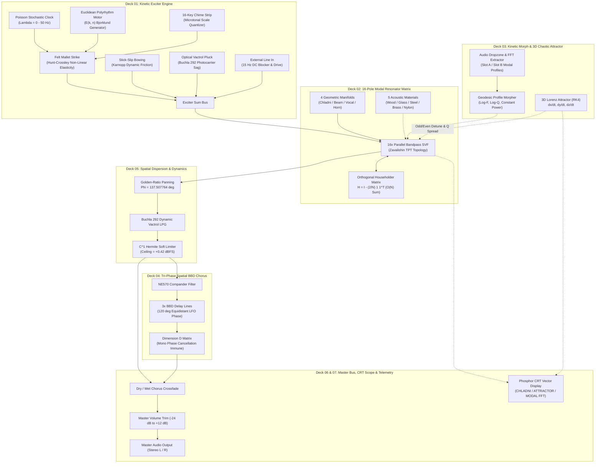

# BRAUN MR-16 · Physical Acoustic Modal Resonator & Synthesizer

[-24FF6A?style=for-the-badge&logo=checkmarx)](https://github.com/sneed-and-feed/braun_mr-16/blob/main/VERIFICATION_CHECKLIST.md)
[](https://github.com/sneed-and-feed/braun_mr-16/releases/tag/v1.0.12)
[](https://github.com/sneed-and-feed/braun_mr-16/releases/download/v1.0.12/BRAUN_MR16-v1.0.12-Windows-x64.zip)
[](https://github.com/sneed-and-feed/braun_mr-16/releases)
[](https://sneed-and-feed.github.io/)
[](https://github.com/sneed-and-feed/braun_mr-16/blob/main/LICENSE)

> *"Weniger, aber besser" — Less, but better.*  
> — Dieter Rams

Welcome to the official **BRAUN MR-16** technical documentation and knowledge base.

The **BRAUN MR-16** is an authentic physical acoustic modal resonator and kinetic impulse synthesizer engineered in C++20 and the Web Audio API. Inspired by the functionalist industrial design principles of Dieter Rams and 1960s Braun acoustic laboratories, the instrument models physical excitation mechanics—mass-spring felt mallet impacts, continuous stick-slip friction bowing, optical vactrol plucking, and live line-input re-amping—coupled into a 16-pole modal resonator matrix with 4 geometric manifolds, orthogonal Householder energy scattering, continuous 3D chaotic Lorenz attractor steering, and tri-phase spatial bucket-brigade device (BBD) chorusing.

The instrument operates in two distinct acoustic domains:
1. **Expressive Physical Synthesizer (Instrument Mode):** Playable via MIDI controllers or the onboard 16-key microtonal chime performance strip with 6 curated harmonic scales, generative Poisson rain, and Euclidean polyrhythms.
2. **Acoustic Resonator & Re-Amper (Audio Effect Mode):** Processing external drums, synths, and vocal stems via the `EXT IN` line drive, transforming dry digital audio into resonant physical bodies such as Chladni steel plates, wooden marimba bars, Tibetan bronze bells, or vocal tract cavities.

The MR-16 runs 100% client-side via the **[Live Web Audio Showcase](https://sneed-and-feed.github.io/)** (Safari, Chrome, Edge, Firefox, iOS, and Android) and ships as precompiled native **VST3**, **CLAP**, and **Standalone** desktop applications for Windows, alongside cross-platform compilation targets for macOS (Universal AU/VST3) and Linux (WebKitGTK).

---

## Precompiled Releases & Distribution (Current: v1.0.12)

| Platform | Format | Release Package | Status |
| :--- | :--- | :--- | :--- |
| **Web Browser** | Web Audio & Web MIDI | [Live Web Showcase](https://sneed-and-feed.github.io/) | Zero-install, 100% client-side |
| **Windows x64** | VST3, CLAP & Standalone | [BRAUN_MR16-v1.0.12-Windows-x64.zip](https://github.com/sneed-and-feed/braun_mr-16/releases/download/v1.0.12/BRAUN_MR16-v1.0.12-Windows-x64.zip) | Full Desktop Bundle (Standalone .exe + VST3 + CLAP) |
| **Windows x64** | VST3 Plugin Only | [BRAUN_MR16-v1.0.12-VST3-Windows-x64.zip](https://github.com/sneed-and-feed/braun_mr-16/releases/download/v1.0.12/BRAUN_MR16-v1.0.12-VST3-Windows-x64.zip) | Standalone VST3 bundle for DAW directories |
| **macOS Universal** | AUv2, VST3, CLAP, Standalone | [CMake Build Guide](Compiling-from-Source) | Apple Silicon (M1–M4) & Intel x86_64 |
| **Linux** | VST3, CLAP & Standalone | [CMake Build Guide](Compiling-from-Source) | WebKitGTK 4.0/4.1 & ALSA/JACK/PipeWire |

---

## Quick Navigation

| Document | Description |
| :--- | :--- |
| **[Sound Design & Signal Flow](Acoustic-Sound-Design-and-Signal-Flow)** | Comprehensive analysis of the 7-deck signal flow, Hunt-Crossley mechanics, Karnopp stick-slip friction, 16-pole Zavalishin SVF core, Householder scattering, and full 33 APVTS parameter specification. |
| **[Sample-to-Modal Extraction & Morphing](Sample-to-Modal-Extraction-and-Morphing)** | Step-by-step guide to dragging and dropping audio files, 4096-point Radix-2 FFT analysis, sub-bin parabolic peak interpolation, temporal decay regression, and dual-slot Lorenz-steered A/B morphing. |
| **[Performance & Playing Guide](Performance-and-Playing-Guide)** | How to perform on the 16-key microtonal chime strip, computer keyboard hotkeys (`A`–`B`), 6 microtonal scales, strike audition buttons, and generative ambient automation. |
| **[DAW Setup & Acoustic Re-Amping](DAW-Setup-and-Acoustic-Re-Amping)** | Host configuration guide for Ableton Live, FL Studio, Reaper, Logic Pro, Bitwig, and Cubase. Re-chassising drum machines, processing vocals, and right-click parameter automation. |
| **[Preset Cookbook & Recipes](Preset-Cookbook)** | Deep dive into all 16 curated factory presets, physical modeling acoustics, and production recipes (ambient rain, bowed titanium, drum re-amping, crystal bells). |
| **[Compiling from Source](Compiling-from-Source)** | Multi-platform CMake build instructions for Windows (WebView2), macOS, and Linux (WebKitGTK), test execution scripts, and release packaging workflows. |

---

## 7-Deck System Architecture & Signal Flow

The MR-16 architecture is organized into 7 distinct functional decks following the strict spatial ergonomics of Dieter Rams studio equipment:



---

## Core Architectural Pillars

### 1. 16-Pole Modal Resonator Matrix with Orthogonal Householder Scattering
At the core of the MR-16 are 16 parallel 2nd-order topology-preserving transform (TPT) state variable bandpass filters operating with unconditional numerical stability. Unlike isolated modal filters that sound static and synthetic, the MR-16 interconnects all 16 modes through an **orthogonal Householder scattering matrix**:

```math
\mathbf{H} = \mathbf{I} - \frac{2}{N}\mathbf{1}\mathbf{1}^T
```

Because this matrix is unitary ($\mathbf{H}^T\mathbf{H} = \mathbf{I}$), mutual acoustic energy is redistributed across all 16 modes on every sample step without energy gain or loss. This enables physical sympathetic vibration, inharmonic ring-down, and natural acoustic bloom with $O(N)$ computational efficiency.

### 2. Four Geometric Manifolds & Five Calibrated Acoustic Materials
Modes are dispersed across four mathematical geometries:
- **Chladni Plate**: Transverse biharmonic 4th-order plate modes ($\nabla^4 w = -\frac{\rho h}{D}\ddot{w}$) producing the classic resonant spectra of bells, gongs, and sheet metal.
- **Stiff Beam**: Euler-Bernoulli beam with shear deformation corrections, characteristic of marimba and xylophone tone bars.
- **Vocal Formant Tract**: 16-pole cascaded acoustic tube model matching physical human vocal tract formants across varying vowel configurations.
- **Poincaré Hyperbolic Horn**: Negative spatial curvature acoustic cavity with non-linear flare expansion.

These geometries are parameterized by five physical material damping profiles: **Wood (Spruce/Rosewood)**, **Glass (Borosilicate)**, **High-Carbon Steel**, **Bell Bronze**, and **Viscoelastic Nylon**.

### 3. Four Kinetic Physical Exciter Models
To excite the acoustic resonator, Deck 01 provides four distinct excitation mechanisms:
1. **Felt Mallet Strike**: Hunt-Crossley non-linear spring-damper contact mechanics ($F_c = k_c x^\alpha + \lambda_c x^\alpha \dot{x}$).
2. **Continuous Bowing**: Karnopp stick-slip friction model with Stribeck velocity-dependent breakaway dynamics.
3. **Optical Vactrol Pluck**: Light-dependent CdS photoresistor model with non-linear phosphorescent sag.
4. **External Line In**: 15 Hz DC-blocked audio input stage with dedicated drive trim for re-chassising external drum machines, synthesizers, and recorded instruments.

### 4. Continuous 3D Chaotic Lorenz Attractor Steering
Deck 03 houses an autonomous non-linear dynamical system integrated at audio rate via 4th-order Runge-Kutta (RK4):

```math
\frac{dx}{dt} = \sigma (y - x), \quad \frac{dy}{dt} = x (\rho - z) - y, \quad \frac{dz}{dt} = x y - \beta z
```

The trajectory coordinates dynamically perturb the 16 modal resonators in real time:
- $X$ coordinate detunes odd modal frequencies.
- $Y$ coordinate detunes even modal frequencies.
- $Z$ coordinate modulates modal $Q$-factor bandwidths and stereo spatialization.

### 5. Tri-Phase Spatial BBD Chorus with Dimension D Phase Immunity
Deck 04 emulates vintage bucket-brigade device (BBD) delay lines driven by three LFOs separated by $120^\circ$. A Roland Dimension D style cross-mixing matrix provides wide stereo decorrelation. Because the mono sum difference yields phasor magnitude $\sqrt{3} \approx 1.732 \ne 0$, the spatial chorus is **mathematically immune to destructive mono phase cancellation**.

### 6. Client-Side Sample-to-Modal Parameter Extraction
Deck 03 features a drag-and-drop audio dropzone. Users can drop any `.wav`, `.mp3`, or `.flac` file directly into the plugin window. An internal 4096-point Radix-2 FFT with sub-bin parabolic peak interpolation and multi-slice temporal envelope regression decomposes the audio into a 16-pole modal profile (`Slot A` or `Slot B`), allowing continuous log-frequency and log-$Q$ geodesic morphing between recorded acoustic instruments.

---

## Release Milestones & Changelog (v1.0.10 – v1.0.12)

### v1.0.12 (VST3 Editor Lifecycle & Parameter Persistence Fix)
- **Synchronous Web Options State Injection:** Replaced asynchronous Web-to-C++ handshake with JUCE 8 `withUserScript(window.__JUCE_INITIAL_PARAMS__)`, synchronously injecting all 33 running APVTS parameter values and discrete states into Chromium before DOM evaluation.
- **Knob Direct Value Instantiation:** Updated `BraunKnob` constructor to instantiate knobs directly from injected values, eliminating UI knob jump and resetting when reopening plugin editor windows while audio is actively playing.
- **Discrete Selector Synchronization:** Added `_syncInitialDiscreteState()` to immediately set active button styling and states for `power_state`, `scope_source`, `exciter_type`, `manifold_type`, `material_profile`, `chorus_enable`, `chorus_dimension`, `display_mode`, `poisson_density`, and `currentProgram`.
- **DOM Ready Lifecycle Guard:** Wrapped application initialization in `bootstrapMr16` with `document.readyState` checks to eliminate script execution race conditions in embedded WebView2 hosts.
- **Unified Test Verification:** 100% pass rate achieved across 207 C++ DSP tests and 213 Web UI unit tests (44 test suites).

### v1.0.11 (APVTS Buffer Bounds & Telemetry Hardening)
- **APVTS Buffer Bounds Alignment:** Expanded `PluginEditor.h` parameter buffer bounds (`kNumParams = 33`), eliminating memory truncation on the web bridge.
- **Two-Way Bridge Handshake:** Hardened `requestSync` handshake between JUCE C++ backend and HTML5 frontend.
- **Persistent Scope Source:** Added `scope_source` and `currentProgram` to APVTS XML state tree for total session recall in DAW projects.

### v1.0.10 (Initial Release & Core Architecture)
- Complete 7-deck physical acoustic synthesis and modal resonator engine.
- 16-pole parallel Zavalishin TPT bandpass SVF core with $O(N)$ Householder feedback.
- 4 geometric manifolds (Chladni Plate, Stiff Beam, Vocal Formant, Poincaré Horn) and 5 material damping profiles.
- 4 kinetic exciter models (Hunt-Crossley Strike, Karnopp Bowing, Vactrol Pluck, External Line In).
- Client-side 4096-point sample-to-modal FFT extractor and dual-slot morpher.
- 16-key microtonal chime performance strip with 6 curated scales and computer hotkey bindings.
- 16 factory presets covering mallet percussion, bowed friction, bells, vocal cavities, and chaotic soundscapes.

---

## Legal Notice & Trademark Disclaimer

The **BRAUN MR-16** is an independent homage to the industrial design language of Dieter Rams and 1960s Braun audio equipment.

- **Manufacturer**: Sneed's Feed & Seed Ltd.
- **Homage Disclaimer**: Not affiliated with Braun GmbH. Dieter Rams inspired design homage.
- **DAW Identification**: Plugin manufacturer code `Brun`, plugin code `Mr16`, and CLAP identifier `com.sneedandfeed.mr16` are retained for DAW session compatibility.
