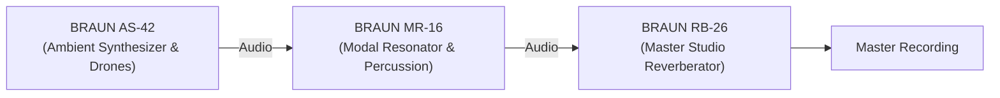

# Preset Cookbook & Studio Recipes

The **BRAUN MR-16** ships with **16 curated factory presets** engineered to demonstrate the acoustic breadth of physical modal synthesis: from wooden marimbas and crystalline wine glasses to bowed sheet metal, generative rainscapes, and extreme self-oscillating singularites.

---

## The 16 Factory Presets

| # | Preset ID | Preset Name | Category | Primary Manifold & Material | Exciter Model |
|:---:|:---|:---|:---|:---|:---|
| 01 | `DEFAULT_CONCERT_CHLADNI` | CALIBRATED DEFAULT | Studio Benchmark | Chladni Plate · Steel | Felt Mallet Strike |
| 02 | `MARIMBA_ROSEWOOD_BAR` | MARIMBA ROSEWOOD BAR | Mallet & Wood | Stiff Beam · Wood | Soft Mallet Strike |
| 03 | `CRYSTAL_WINE_GLASS` | CRYSTAL WINE GLASS | Friction & Glass | Chladni Plate · Glass | Stick-Slip Friction |
| 04 | `TIBETAN_BRONZE_BELL` | TIBETAN BRONZE BELL | Metallic Plates | Chladni Plate · Brass | Metal Striker |
| 05 | `CATHEDRAL_TUBE_DRONE` | CATHEDRAL TUBE DRONE | Acoustic Cavity | Poincaré Horn · Steel | Air Jet / Vactrol |
| 06 | `VOCAL_FORMANT_CHOIR` | VOCAL FORMANT CHOIR | Vocal Tract | Vocal Formant · Nylon | Vactrol Pluck |
| 07 | `POISSON_ZINC_ROOF` | POISSON ZINC ROOF | Kinetic Stochastic | Chladni Plate · Steel | Poisson Rain (16 Hz) |
| 08 | `EUCLIDEAN_METALLOPHONE` | EUCLIDEAN METALLOPHONE | Polyrhythmic | Stiff Beam · Brass | Euclidean (5/16 Clock) |
| 09 | `DIMENSION_CELESTE` | DIMENSION CELESTE | Spatial Chorus | Chladni Plate · Steel | Felt Mallet Strike |
| 10 | `LORENZ_CHAOTIC_ORBIT` | LORENZ CHAOTIC ORBIT | Chaotic Morph | Chladni Plate · Steel | Continuous Lorenz Mod |
| 11 | `BOWED_TITANIUM_SHEET` | BOWED TITANIUM SHEET | Bowed Friction | Chladni Plate · Steel | Stick-Slip Bow |
| 12 | `HYPERBOLIC_SUB_RESONATOR`| HYPERBOLIC SUB RESONATOR | Sub Bass | Poincaré Horn · Wood | Low-Freq Vactrol LPG |
| 13 | `AFRICAN_BALAFON` | AFRICAN BALAFON | World Acoustic | Stiff Beam · Wood | Hard Mallet Strike |
| 14 | `SOLAR_WIND_RESONANCE` | SOLAR WIND RESONANCE | Ambient Drone | Poincaré Horn · Glass | Poisson Droplets (28 Hz) |
| 15 | `FROSTED_GLASS_ARPEGGIO` | FROSTED GLASS ARPEGGIO | Generative | Chladni Plate · Glass | Euclidean (7/12 Clock) |
| 16 | `INFINITE_MODAL_SINGULARITY`| INFINITE MODAL SINGULARITY | Extreme Oscillation | Chladni Plate · Brass | 100% Householder Feedback |

---

## Deep Dive: Preset Analysis & Acoustic Design

### 01. `DEFAULT_CONCERT_CHLADNI` (Calibrated Default)
- **Acoustic Character:** A neutral reference standard. Simulates a $0.5\text{ m} \times 0.5\text{ m}$ square high-carbon steel plate struck by a medium-density felt piano hammer.
- **Key Parameters:**
  - `manifold_type`: `0` (Chladni Plate), `material_profile`: `2` (Steel)
  - `modal_frequency`: `220.0 Hz` (A3), `modal_damping`: `1.80s`
  - `modal_coupling`: `0.40` (40% Householder feedback)
  - `chorus_mix`: `45%`, `golden_pan_spread`: `85%`
- **Playing Advice:** Play melodic lines on the chime strip using `SCALE: BUDD PENTATONIC`. Notice how struck modes scatter energy into adjacent partials without dissonant clashing.

### 02. `MARIMBA_ROSEWOOD_BAR`
- **Acoustic Character:** An authentic Central American rosewood marimba tone bar. The Euler-Bernoulli beam dispersion produces pronounced fundamental resonance with rapid high-frequency absorption.
- **Key Parameters:**
  - `manifold_type`: `1` (Stiff Beam), `material_profile`: `0` (Wood)
  - `modal_frequency`: `174.6 Hz` (F3), `modal_damping`: `0.95s`
  - `strike_hardness`: `0.42` (Soft felt contact), `strike_velocity`: `0.85`
  - `vactrol_lpg_cutoff`: `8500 Hz`
- **Playing Advice:** Snap the chime root to `F (174 Hz)` and perform rapid two-handed glissandi. The organic wood thud is governed by the Hunt-Crossley contact model.

### 03. `CRYSTAL_WINE_GLASS`
- **Acoustic Character:** A wet finger circling the rim of a fine borosilicate crystal wine glass. Continuous friction excites ultra-pure high-$Q$ modes ($Q \approx 380$) that ring indefinitely.
- **Key Parameters:**
  - `exciter_type`: `1` (Friction), `manifold_type`: `0` (Chladni), `material_profile`: `1` (Glass)
  - `modal_frequency`: `440.0 Hz` (A4), `modal_damping`: `4.20s`, `modal_q`: `280.0`
  - `friction_force`: `0.58`, `friction_speed`: `0.38`
- **Playing Advice:** Click `BOWED FRICTION` or hold keys on a MIDI controller with aftertouch. Modulating `friction_speed` produces authentic singing friction squeals.

### 04. `TIBETAN_BRONZE_BELL`
- **Acoustic Character:** A heavy hand-hammered Himalayan singing bowl. Deep foundational pitch surrounded by rich, shimmering inharmonic overtones that swell as energy circulates through the Householder matrix.
- **Key Parameters:**
  - `manifold_type`: `0` (Chladni), `material_profile`: `3` (Brass/Bronze)
  - `modal_frequency`: `110.0 Hz` (A2), `modal_damping`: `5.80s`
  - `modal_coupling`: `0.72` (Heavy sympathetic energy exchange)
- **Playing Advice:** Tap `Spacebar` to trigger the Dirac impulse, then listen to the bell bloom and beat for 10+ seconds.

### 05. `CATHEDRAL_TUBE_DRONE`
- **Acoustic Character:** A cavernous cathedral pipe organ driven by air jet flutter and optical vactrol sag. The Poincaré negative curvature flare provides massive acoustic space.
- **Key Parameters:**
  - `exciter_type`: `2` (Vactrol), `manifold_type`: `3` (Poincaré Horn)
  - `modal_frequency`: `65.4 Hz` (C2), `vactrol_sag`: `0.68`
  - `chorus_dimension`: `0.90`, `chorus_mix`: `65%`
- **Playing Advice:** Ideal for deep, spiritual drone beds. Pair with sustain pedal (CC 64) for endless pipe resonance.

### 06. `VOCAL_FORMANT_CHOIR`
- **Acoustic Character:** A 16-pole human vocal tract cavity. Formant bandwidths $B_m \propto \sqrt{f_m}$ match physical vowels (/a/, /e/, /i/, /o/, /u/) modulated by continuous 3D Lorenz attractor drift.
- **Key Parameters:**
  - `manifold_type`: `2` (Vocal Formant), `material_profile`: `4` (Nylon)
  - `lorenz_rate`: `0.35 Hz`, `lorenz_freq_mod`: `28%`, `lorenz_q_mod`: `30%`
- **Playing Advice:** Perform chords using `SCALE: LYDIAN DREAM`. The vocal formants will morph organically between open and closed vowels without repeating.

### 07. `POISSON_ZINC_ROOF`
- **Acoustic Character:** An automated generative rain installation. Stochastic Poisson droplets strike a thin corrugated zinc roof, scattered across the stereo panorama via the golden angle.
- **Key Parameters:**
  - `exciter_type`: `0` (Strike), `poisson_density`: `16.5 Hz`
  - `manifold_type`: `0` (Chladni), `material_profile`: `2` (Steel)
  - `golden_pan_spread`: `95%`
- **Playing Advice:** Hands-free generative ambient sound. Modulate `poisson_density` to simulate a gentle drizzle building into a heavy summer downpour.

### 08. `EUCLIDEAN_METALLOPHONE`
- **Acoustic Character:** A clocked West African brass metallophone performing a balanced 5/16 polyrhythm.
- **Key Parameters:**
  - `euclidean_pulses`: `5`, `euclidean_steps`: `16`
  - `manifold_type`: `1` (Stiff Beam), `material_profile`: `3` (Brass)
  - `modal_coupling`: `0.48`, `chorus_enable`: `1`
- **Playing Advice:** Change `euclidean_pulses` between 3, 5, 7, and 11 to explore interlocking rhythmic bell geometry in real time.

### 11. `BOWED_TITANIUM_SHEET`
- **Acoustic Character:** Tension-loaded theatrical sheet metal excited by a heavy double-bass bow. Aggressive, dark, cinematic suspense.
- **Key Parameters:**
  - `exciter_type`: `1` (Friction), `manifold_type`: `0` (Chladni), `material_profile`: `2` (Steel)
  - `friction_force`: `0.78`, `friction_speed`: `0.55`
  - `drive_saturation`: `45%`
- **Playing Advice:** Modulate `friction_force` via MIDI CC to produce startling metallic screech transients for film scoring.

### 16. `INFINITE_MODAL_SINGULARITY`
- **Acoustic Character:** Extreme physical feedback self-oscillation. The Householder coupling is cranked to maximum ($100\%$), transforming the 16 modal filters into an interconnected resonant oscillator. The signal is bounded safely below $0\text{ dBFS}$ by the $C^1$ Hermite soft limiter.
- **Key Parameters:**
  - `modal_coupling`: `1.00` (100% Householder feedback)
  - `modal_damping`: `8.5s`, `modal_q`: `180.0`
  - `drive_saturation`: `65%`
- **Playing Advice:** Strike a single note or tap `Spacebar`. The instrument will ring indefinitely, shifting energy chaotically across modes like a self-sustaining physical pendulum.

---

## Master Studio Sound Design Recipes

### Recipe 1: Generative Harold Budd Ambient Rainscape
1. Select Preset `07: POISSON_ZINC_ROOF`.
2. Change `MATERIAL PROFILE` to `GLASS` (Borosilicate).
3. Set `modal_frequency` to `330.0 Hz` (E4) and `modal_damping` to `3.2s`.
4. Turn `lorenz_rate` to `0.15 Hz`, `lorenz_chaos` to `0.45`, and `lorenz_freq_mod` to `12%`.
5. Set `golden_pan_spread` to `100%` and `chorus_mix` to `50%`.
6. **Result:** An ethereal, self-generating ambient cloud of microtonal glass droplets that drifts slowly across time and space.

### Recipe 2: Organic Drum Re-Chassising (Acoustic Snare from White Noise)
1. Route an electronic 808 or white noise burst into the MR-16 via DAW audio insert.
2. Set `EXCITER MODE` to `EXT IN` with `ext_input_gain = +3.0 dB`.
3. Select `MANIFOLD: BEAM` and `MATERIAL: WOOD`.
4. Tune `modal_frequency` to `196 Hz` (G3) with `modal_damping = 0.85s`.
5. Set `modal_coupling = 0.40` and `dry_wet_mix = 75% Wet`.
6. **Result:** The electronic noise excites the mass and physical body of a rosewood marimba tone bar, producing a rich acoustic snare.

---

## Companion Synergy: BRAUN Modular Suite

The MR-16 forms the kinetic percussion and modal core of the BRAUN trio:

- **[BRAUN AS-42](https://github.com/sneed-and-feed/braun_as-42):** Generates Harold Budd chord clusters, felt piano transients, and microtonal sub-drones.
- **BRAUN MR-16:** Re-chassises the AS-42 audio through 16-pole Chladni plates or vocal tract cavities, while providing kinetic percussion.
- **[BRAUN RB-26](https://github.com/sneed-and-feed/braun_rb-26):** Catches the resonated acoustic output in an 8-line Feedback Delay Network (FDN) with infinite freeze and bidirectional pitch diffusion.
