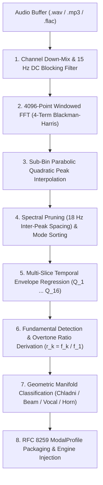

# Sample-to-Modal Extraction & Morphing

A central architectural innovation of the **BRAUN MR-16** is its client-side **Sample-to-Modal Extraction Engine**. Rather than relying on traditional sample playback or wavetable resynthesis, the MR-16 allows you to drop arbitrary recorded audio files into the interface, where an onboard 4096-point mathematical DSP pipeline decomposes the sound into a living 16-pole physical acoustic resonator.

---

## Physical Modeling vs. Traditional PCM Sampling

| Characteristic | Traditional PCM Sample Playback | MR-16 16-Pole Modal Resonator |
| :--- | :--- | :--- |
| **Acoustic Reality** | Static playback of a pre-recorded performance | Responsive physical object that reacts to velocity and exciter mechanics |
| **Pitch Transposition** | "Chipmunk" effect, phase smearing, stretched transients | Independent retuning of fundamental frequency ($f_0$) without formant warping |
| **Decay Control** | Artificial amplitude envelopes cutting off natural ring-down | Physical material damping ($Q$-factor) and viscous loss scaling |
| **Sympathetic Vibration** | None (samples remain isolated) | Full Householder energy scattering between all 16 vibrating modes |
| **Morphing Potential** | Linear volume crossfading (causes comb filtering) | True geodesic log-frequency and log-$Q$ interpolation |
| **Memory Footprint** | Hundreds of megabytes of raw audio sample banks | Lightweight RFC 8259 JSON mathematical profiles (~2 KB per instrument) |

---

## The Drag-and-Drop Workflow

```text
+-----------------------------------------------------------------------------------------+
| DECK 03: KINETIC MORPH & 3D ATTRACTOR                                                   |
|                                                                                         |
|  [ SLOT A ]  [ SLOT B ]    [ LOAD SAMPLE ]    [ EXPORT PROFILE ]                        |
|                                                                                         |
|  +-----------------------------------------------------------------------------------+  |
|  | DROP AUDIO FILE TO EXTRACT 16-POLE MODAL PROFILE (SLOT A/B)                       |  |
|  | (.wav, .mp3, .flac, .ogg, .aiff - up to 50 MB)                                    |  |
|  +-----------------------------------------------------------------------------------+  |
|                                                                                         |
|  ( ) MORPH A/B       ( ) LORENZ STEER       ( ) LORENZ RATE       ( ) LORENZ CHAOS      |
+-----------------------------------------------------------------------------------------+
```

### Step-by-Step Procedure:
1. **Select Target Slot:** Click `SLOT A` or `SLOT B` in the Deck 03 header to designate which memory slot will receive the extracted modal profile.
2. **Drop an Audio File:** Drag any audio file (`.wav`, `.mp3`, `.flac`, `.ogg`, `.aiff`, or `.m4a`, up to 50 MB) directly onto the Deck 03 dropzone target or anywhere across the plugin chassis.
3. **Automated DSP Analysis:** The MR-16 automatically decodes the PCM data and runs the 8-stage extraction pipeline in real time.
4. **Instant Acoustic Synthesis:** The 16 resonators immediately adapt to the extracted frequencies, $Q$-damping factors, and relative modal gains. The button updates to show the detected manifold classification (e.g. `A: CHLADNI` or `B: BEAM`).
5. **Geodesic Morphing:** Turn the `MORPH A/B` knob to smoothly morph the physical body between Slot A and Slot B. Engage `LORENZ STEER` to let the chaotic 3D attractor continually steer the interpolation path.

---

## The Mathematical Extraction Pipeline

The extraction algorithm is implemented in [`modal_extractor.js`](file:///C:/Users/x/Documents/antigravity/braun_mr-16/web/js/audio/modal_extractor.js) and executes in eight sequential stages:



### Stage 1: Channel Down-Mix & DC Blocking
Incoming multi-channel buffers are averaged to mono Float32 arrays with equal channel weighting:

```math
x_{\mathrm{mono}}[n] = \frac{1}{C} \sum_{c=0}^{C-1} x_c[n]
```

To eliminate DC offset biases that could distort low-frequency modal peaks, the signal passes through a 1st-order highpass DC blocking filter ($f_c \approx 15\text{ Hz}$ at 48 kHz):

```math
y[n] = x[n] - x[n-1] + r \cdot y[n-1], \quad r = 0.998
```

### Stage 2: 4096-Point FFT with 4-Term Blackman-Harris Windowing
To achieve high frequency resolution while eliminating spectral leakage between closely spaced resonant partials, the initial onset window ($N = 4096$) is multiplied by a **4-term Blackman-Harris window**:

```math
w[i] = a_0 - a_1 \cos\left( \frac{2\pi i}{N-1} \right) + a_2 \cos\left( \frac{4\pi i}{N-1} \right) - a_3 \cos\left( \frac{6\pi i}{N-1} \right)
```

where:
- $a_0 = 0.35875$
- $a_1 = 0.48829$
- $a_2 = 0.14128$
- $a_3 = 0.01168$

This window provides $-92\text{ dB}$ **side-lobe suppression**, ensuring weak upper partials are not masked by window leakage from low-frequency fundamentals. The windowed buffer is transformed via an in-place Radix-2 Cooley-Tukey decimation-in-time FFT.

### Stage 3: Sub-Bin Parabolic Quadratic Peak Interpolation
At $f_s = 48\text{ kHz}$ and $N = 4096$, each FFT bin has a width of:

```math
\Delta f = \frac{f_s}{N} = \frac{48000}{4096} \approx 11.71875\text{ Hz}
```

Relying solely on discrete bin indices causes substantial pitch quantization errors (up to $\pm 5.86\text{ Hz}$). When a local maximum is identified ($y_0 > y_{-1}$ and $y_0 > y_{+1}$), the MR-16 performs **parabolic interpolation on the logarithmic magnitude spectrum**:

```math
\alpha = 20\log_{10}(y_{-1}), \quad \beta = 20\log_{10}(y_0), \quad \gamma = 20\log_{10}(y_{+1})
```

The true peak bin offset $\delta \in [-0.5, +0.5]$ is derived analytically from the vertex of the fitting parabola:

```math
\delta = \frac{1}{2} \left( \frac{\alpha - \gamma}{\alpha - 2\beta + \gamma} \right)
```

The refined modal frequency and true peak amplitude are calculated as:

```math
f_{\mathrm{peak}} = (k + \delta) \cdot \frac{f_s}{N}
```

```math
\mathrm{Amp}_{\mathrm{peak}} = 10^{\frac{\beta - \frac{1}{4}(\alpha - \gamma)\delta}{20}}
```

This reduces frequency estimation error from $\pm 5.86\text{ Hz}$ to less than $\pm 0.08\text{ Hz}$.

### Stage 4: Spectral Pruning & Mode Selection
Detected peaks are sorted by descending amplitude and passed through an inter-peak distance filter:
- Candidate peaks separated by less than $18\text{ Hz}$ from an already accepted higher-amplitude peak are discarded as window side-lobes or phase artifacts.
- The top 16 dominant peaks are selected and sorted in ascending order of frequency ($f_0 < f_1 < \dots < f_{15}$).

### Stage 5: Multi-Slice Temporal Envelope Regression for $Q$-Factors
A static FFT only reveals where resonant frequencies lie, not how long they ring. To determine the physical damping factor $\alpha_k$ and quality factor $Q_k$ of each mode, the extractor analyzes 6 successive time slices spaced across the sample duration.

For each mode $m$, the local spectral energy is tracked across time:

```math
t_s = s \cdot \frac{\text{hopSamples}}{f_s}, \quad s \in \lbrace 0, 1, \dots, 5 \rbrace
```

Applying **Ordinary Least Squares (OLS) Linear Regression** to the logarithmic decay envelope:

```math
\ln(A_m(t)) = \ln(A_{m,0}) - \alpha_m \cdot t
```

The decay rate slope $\alpha_m$ is determined via:

```math
\alpha_m = -\frac{\sum (t_s - \bar{t})(y_s - \bar{y})}{\sum (t_s - \bar{t})^2}
```

From physical vibration theory, the modal quality factor $Q_m$ and $RT_{60}$ decay time are given by:

```math
Q_m = \frac{\pi \, f_m}{\alpha_m}
```

```math
\tau_{60, m} = \frac{\ln(1000)}{\alpha_m} \approx \frac{6.907755}{\alpha_m}
```

Values are clamped to physically stable acoustic boundaries ($Q_m \in [8.0, 480.0]$).

### Stage 6: Overtone Ratio Normalization
The fundamental frequency $f_1$ is established as the lowest dominant mode. Overtone ratios are computed as:

```math
r_k = \frac{f_k}{f_1}, \quad k \in \lbrace 0, \dots, 15 \rbrace
```

### Stage 7: Geometric Manifold Classification
The measured 16-ratio vector $\mathbf{r}$ is compared against the theoretical closed-form ratios of the four supported physical manifolds: **Chladni Plate**, **Stiff Beam**, **Vocal Formant**, and **Poincaré Horn**.

The Mean Squared Error (MSE) is evaluated in $\log_2$ frequency space:

```math
\mathrm{MSE}_M = \frac{1}{16} \sum_{i=0}^{15} \left( \log_2(r_i) - \log_2(r_{M, i}) \right)^2
```

A softmax probability distribution (temperature $\tau = 0.35$) determines the best-fitting manifold and confidence metric:

```math
P(M) = \frac{e^{-\mathrm{MSE}_M / \tau}}{\sum_{k} e^{-\mathrm{MSE}_k / \tau}}
```

The resulting manifold type is displayed on the UI and logged in the profile metadata.

---

## Dual-Slot A/B Morphing

Once profiles are loaded into **Slot A** and **Slot B**, the MR-16 performs real-time continuous morphing parameterized by the `MORPH A/B` knob ($\alpha \in [0.0, 1.0]$).

```text
[ SLOT A: CHLADNI STEEL ] <======== MORPH A/B ========> [ SLOT B: VOCAL FORMANT ]
         alpha = 0.0                    alpha = 0.5                   alpha = 1.0
```

### Geodesic Interpolation Mathematics
Linear parameter interpolation ($\theta = (1 - \alpha)\theta_A + \alpha \theta_B$) distorts pitch intervals and causes perceived volume dips. The MR-16 uses **geodesic manifold interpolation**:

1. **Log-Frequency Interpolation (Preserves Musical Intervals):**
   
   ```math
   f_i(\alpha) = f_{A,i}^{1 - \alpha_i} \cdot f_{B,i}^{\alpha_i} = \exp\left( (1 - \alpha_i) \ln(f_{A,i}) + \alpha_i \ln(f_{B,i}) \right)
   ```

2. **Log-$Q$ Damping Factor Interpolation:**
   
   ```math
   Q_i(\alpha) = Q_{A,i}^{1 - \alpha_i} \cdot Q_{B,i}^{\alpha_i} = \exp\left( (1 - \alpha_i) \ln(Q_{A,i}) + \alpha_i \ln(Q_{B,i}) \right)
   ```

3. **Constant-Power Gain Crossfading:**
   
   ```math
   \mathrm{gain}_i(\alpha) = \sqrt{(1 - \alpha_i) \cdot \mathrm{gain}_{A,i}^2 + \alpha_i \cdot \mathrm{gain}_{B,i}^2}
   ```

### 3D Lorenz Attractor Trajectory Steering
Engaging `LORENZ STEER` dynamically perturbs the interpolation coordinate $\alpha_i$ for each individual mode using the real-time coordinates of the 3D Lorenz attractor $(x(t), y(t), z(t))$:

Normalized coordinates are projected across the 16 modes using golden-angle phase offsets ($\Phi = 137.507764^\circ$):

```math
\delta_i = \frac{1}{2} \left[ \bar{x} \sin(i \cdot \Phi) + \bar{y} \cos(i \cdot \Phi) + \bar{z} \sin(2i \cdot \Phi) \right]
```

```math
\alpha_i = \mathrm{clamp}\left( \alpha_{\mathrm{base}} + S_{\mathrm{steer}} \cdot \delta_i, \, 0.0, \, 1.0 \right)
```

As the chaotic attractor orbits its two butterfly lobes, the 16 modes continuously drift along independent non-linear paths between Slot A and Slot B, creating a living acoustic instrument that never repeats.

---

## RFC 8259 ModalProfile JSON Schema

Extracted modal profiles can be exported as standard JSON files (`.json`) for archival and exchange:

```json
{
  "$schema": "https://braun-audio.de/schemas/mr16-modal-profile-v1.json",
  "format": "BRAUN_MR16_MODAL_PROFILE",
  "version": 1,
  "id": "MODAL_M16_STRUCK_GONG_440",
  "name": "Struck Bronze Gong (440 Hz)",
  "timestamp": "2026-09-25T12:00:00.000Z",
  "sampleRate": 48000,
  "fundamental": 440.0,
  "manifoldClassification": {
    "type": "CHLADNI",
    "confidence": 0.942,
    "mse": 0.0124,
    "scores": {
      "CHLADNI": 0.0124,
      "BEAM": 0.0891,
      "VOCAL": 0.1542,
      "HORN": 0.1985
    }
  },
  "frequencies": [440.0, 915.2, 1420.5, 1890.1, 2340.0, 2810.4, 3410.0, 3950.2, 4520.1, 5100.8, 5740.0, 6380.5, 7120.0, 7890.4, 8650.0, 9420.0],
  "qFactors": [120.5, 115.0, 98.4, 85.2, 74.1, 68.0, 55.4, 48.2, 42.1, 38.0, 32.5, 28.1, 24.0, 20.2, 16.5, 12.0],
  "gains": [1.0, 0.82, 0.65, 0.54, 0.42, 0.38, 0.28, 0.22, 0.18, 0.14, 0.10, 0.08, 0.06, 0.04, 0.03, 0.02],
  "ratios": [1.0, 2.08, 3.2284, 4.2957, 5.3182, 6.3873, 7.75, 8.9777, 10.273, 11.5927, 13.0455, 14.5011, 16.1818, 17.9327, 19.6591, 21.4091]
}
```
